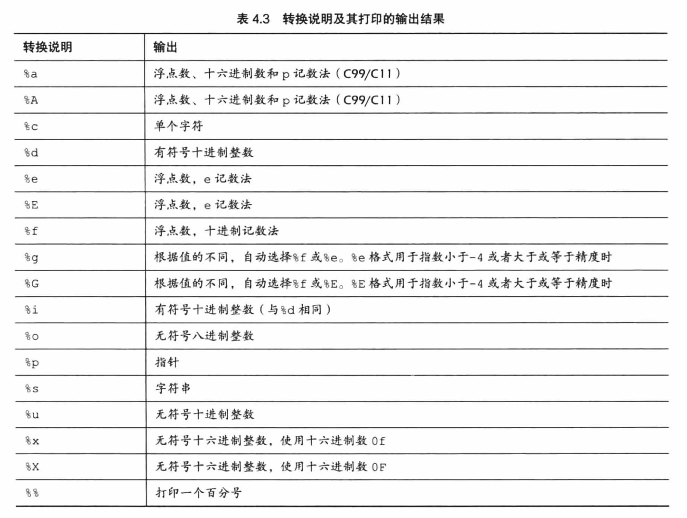
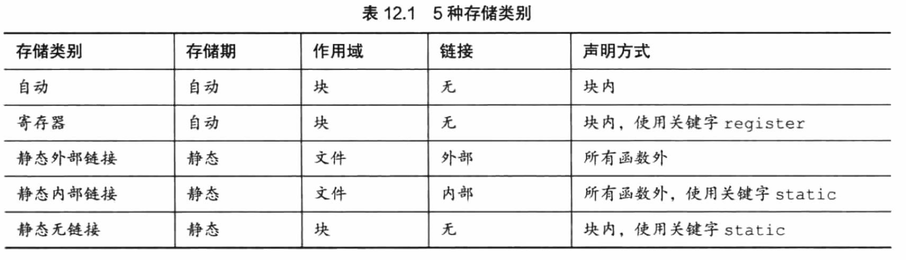

# C 学习笔记:fire:

单片机开发板学习路线：51 (STC公司，适合新手) --> STM (ST公司，追求性能) --> 430 (TI公司，追求低功耗) 

逐渐没落的单片机：PIC、AVR


## 字符串

在 C 语言中没有定义字符串类，并没有像 C++ 中的 string 和 Java 中的 String。

如果要使用字符串，则要使用字符数组（在 C 语言中，字符串是保存在字符数组中的，叫做字符串数组），字符串数组的结尾会有一个空字符 '\0' 来确定字符串结束的位置（<u>注意：'\0' 字符和数字字符 '0' 不同，'\0' 的 ASCII 码为 0，而 '0' 的 ASCII 码为 48</u>），因为数组初始化长度时可能会超过字符串的长度，如果没有这个空字符，就不能算是字符串数组，而只能算成是字符数组。

另外，在计算字符串数组的**<u>长度</u>**时，需要算上结尾的空字符。

:warning: 注意：空字符（**'\0'**）和空指针（**NULL**）的区别，空字符是整数类型，占一个字节，专门用来标记字符串的末尾，没有任何其他字符的编码是 0，所以可以用来唯一标记字符串的末尾；而空指针是指针类型，通常占 4 个字节，该值不会和任何数据的有效地址对应。容易混淆是因为他们都可以用数值 0 来表示。

###初始化字符串

:one: 主要有两种形式初始化：用**<u>指针</u>**变量，或用**<u>字符数组</u>**。

const char * str1 = "Hello World!";

char str2[] = "Hello World!";

以上两种初始化方式类似，但是有所不同。（详见《C Prime Plus》p324）

<u>初始化数组将静态存储区的字符串拷贝到数组中，而初始化指针只把字符串的地址拷贝给指针。</u>

因为程序在载入内存的过程中，会将字符串字面量（双引号中的字符）存储到<u>静态存储区</u>（static memory），在程序开始运行的时候将字符串从静态存储区拿出来拷贝给数组或把地址拷贝给指针。正因为如此，初始化数组的地址和字符串字面量存储的地址不同，而初始化指针的地址和字符串字面量的地址相同。

:warning: 注意：str1 = str2; :white_check_mark: ，str2 = str1; :negative_squared_cross_mark: （常量不能被赋值，而变量可以被常量赋值。）

:two: 另外，在使用指针初始化字符串时，应注意如果改变指针所指的字符串，会导致一些混乱，例如：``char * p = "kiki";`` 如果我们修改第一个字符， ``p[0] = 'f'; `` 然后我们再打印 ``printf("kiki");`` 在控制台出现将不会是 kiki，而是 fiki。所以推荐在使用指针初始化字符串时尽量加上 ``const`` 修饰符，以免字符串字面量被改变。另一方面，数组没有这个问题，因为初始化数组时创建了字符串字面量的副本，即使修改数组也是改变了副本的内容，不会影响到字符串字面量。

:three: 在创建包含多个字符串的数组时，是选择指针还是数组呢？应考虑：使用指针数组的效率将比字符串数组高（因为在存储时，字符串常量先被存储在静态存储区，字符串数组将拷贝他们到自己的数组，而且字符串数组的子数组们都是同一个长度，以最长的字符串常量为准，这些数组在存储空间中还是连续的，这样一来降低了初始化的效率，所占有的内存空间也较大。而指针数组所指向的字符串常量不一定是连续的，也不需要重新拷贝生成新的数组，只需存储字符串常量的地址值就可以，所以占用的内存非常少），但是指针数组所指向的字符串常量不可更改，所以如果需要改变字符串或者需要为字符串输入预留空间，就需要使用字符串数组了。

###转换说明表



###输入输出函数

:one: scanf() 搭配转换说明 %s 只能读取一个单词，**gets()** 可以一次性读取一句话，但因不安全逐渐被抛弃。取而代之的是 **fgets()**，fgets() 有三个参数：第一个是字符数组变量（需要初始化长度），第二个是读取长度（该值比实际读取的长度大 1，因为末尾会自动加上 '\0'），第三个是 "stdin"。和其相匹配的输出函数是 **fputs()**，fputs() 不同于 puts() 的是，它不会自动在字符串结尾加入 '\n' 换行符，而且他有两个参数：第一个是变量名，第二个是 "stdout"。

fgets() 和 fputs() 会储存换行符。

:two: **scanf()** 在读取时，以非空白字符（空行、空格、制表符、换行符）开始，以空白字符结束。如果指定长度，则按长度读取或读到空白字符结束。scanf() 适合用于输入行为一个单词的情景。其存在数据溢出的风险，在 %s 中加入字段宽度可以防止溢出。

:three: **puts()** 包含一个参数，即字符串的地址，在输出时会在遇到空字符 '\0' 时加上一个换行符 '\n'，并停止输出，所以传参中必须包含 '\0' （即传参是一个真正的字符串而不是字符数组）。

在使用输入输出函数的时候，应该配对使用，即使用 gets() 输入时，应搭配使用 puts() 输出，fputs() 和 fgets() <u>搭配使用</u>。因为 gets() 不储存换行符，而 puts() 会打印换行符，fgets() 储存换行符，而 fputs() 不打印换行符。

**printf()** 函数在打印多个字符串时更为方便。

### 字符串函数

:one:  string.h 头文件中包含了字符串函数系列的原型，在使用函数时应声明此头文件。

* strlen(str) 函数返回字符串的长度。
* strcat(str1,str2) 函数用来拼接两个字符串，输入为两个字符串的地址，将第二个字符串复制到第一个字符串后面，不改变第二个字符串的内容。
* strncat(str1, str2, n) 函数指定能拼接的字符串长度 n ，拼接时遇到空字符或达到 n 时停止。
* strcmp(str1, str2) 函数比较两个字符串的内容是否相同。返回第一对不同的字符的 ascii 码的差值（前者减去后者），有时以 1/0/-1 来表示正负。参数不能是字符，而应是字符串，即结尾带有 '\0'。
* strncmp(str1, str2, n) 函数比较两个字符串开头的 n 个字符是否相同。
* strcpy(str1, str2) 函数将第二个参数指向的字符串拷贝到第一个参数指向的字符数组中（一般为数组，因为须确保有足够的存储空间）。返回的是第一个字符的首元素的地址，也就是第一个字符串的地址。
* strncpy(str1, str2, n) 函数规定最大拷贝字符串的长度，长度应设置为小于指向数组的长度，防止溢出。
* sprintf(str1, “ ..%... %... %... ”, ..., ..., ...) 函数将多个元素组合成一个字符串。第一个参数是目标字符串地址，

:two: stdlib.h 头文件包含了字符串转数字的一系列函数原型。

* atoi()
* atof(), atol(), strtol() ...


## 数组

**数组名**表示该数组首元素的地址，是一个地址常量，而非一个变量。

在修改或使用一个数组时，实际上是直接对该数组进行操作的，因为数组参数的传递默认使用的是指针，如果不希望数组参数被改变，可以在形参前加 ``const`` 关键字来限制可能对数组的修改。

###多维数组和指针

举一个例子，一个二维数组 woc [2] [3]，其中 woc [0] 代表的是 woc [0] 子数组首元素的地址值，即 woc [0] [0] 的地址值 (& woc [0] [0])，而 woc 代表的是 woc [0] 的地址值 (& woc [0])。

所以 *woc = woc [0]， *( *woc) = woc [0] [0]。

woc + 1 = & woc [1]，*(woc + 1) = woc [1]。


## 指针

指针也是一种变量，叫做指针变量，不同于其他变量的是，指针变量储存的是它指向的变量的地址（指针的值是地址，<u>注意：内存中存在包含了两个部分，一个是它的值，还有一个是它的地址</u>），如要获取指向的变量的值，可以使用间接运算符（*）。

例：

```` c
#include <stdio.h>
int main(void){
  int i = 5;
  int * p = &i; //将 i 的地址符给指针变量 p
  printf("%d", *p); // *p 将返回 i 的值
}
````


## Main函数参数

````C
//假设这个程序的名称为 “test.c”,生成的可执行目标文件为 “test”
#include <stdio.h>
int main(int argc, char * argv[]){
  //argc 是参数的总个数，没有带参数运行文件时，arg = 1
  //假设我们运行文件，$ ./test hello world
  //此时参数个数为 3，则 argc = 3
  //argv[0] = "./test"，argv[1] = "hello", argv[2] = "world"
}
````


## 存储类别

:one: 在存储中，对象指的是一块内存，可以理解为储存了一个变量或者元素的内存，和面向对象编程语言中的对象不同哦。对象由标识符访问，也就是变量名。凡是能被单独访问的标识符，所指向的内存空间都可以被称为一个对象。

:two: C语言中有不同的作用域，变量在自己的作用域内才能访问，超出就无法访问。然而，无法访问时不代表变量没有被创建，比如，在块作用域中的 static 变量，在程序被载入时就被储存在静态内存中，但只有在作用域内才能被访问。

:three: static 关键字表明变量具有内部链接属性。文件作用域变量全部具有静态存储期。_Thread_local 声明的对象具有线程存储期。块作用域变量具有自动存储期，为了使之变为静态存储期，可以加上 static 关键字。



:four: 寄存器变量在声明后不一定有效，须根据寄存器的状况和变量的类型决定，如，声明一个 double 类型的变量可能不会成功，因为寄存器可能没有那么大的空间。寄存器变量的地址无法被获取。

静态无链接变量只在程序编译时被初始化一次（未赋值则初始化为 0），而自动变量每次调用一次函数都会被初始化。

:five: 一般函数的声明默认是 extern，即外部函数，在其他文件中可以调用。使用 static 关键字可以禁止外部文件的调用。

## 内存分配

:one: malloc() 函数可以创建一个指定大小的内存空间，返回指向该空间的地址，free() 函数可以释放 malloc() 函数创建的内存空间。malloc() 参数为需要的字节大小，free() 参数通常为指针变量，并指向的是 malloc() 创建的内存块。

:two: 静态内存的数量在编译的时候是固定的，在程序运行期间不会改变。

内存分配分为三种，一种是供静态变量使用，一种是供自动变量使用（通常作为栈，按顺序进入，按顺序销毁），还有一种供动态内存分配。

malloc() 和 calloc() 的区别？


## 结构

````c
struct book{
		char title[30];
		char author[20];
  	float value;
};

int main(void){
  struct book bookA = {
    "How to become an A student";
    "xxx xxx";
    20.56
  };
  struct book bookB = {
    .value = 25.99,
    .author = "James",
    .title = "Rue for the Road"
  };
  //声明一个 book 结构数组 library[20]
  struct book library[20];
  //创建一个结构指针，并指向一个结构数组
  struct book * bookC;
  bookC = &library[0]; //bookC = library ??
  //bookC->title == (*bookC).title == library[0].title
}


````

在结构中，如果要使用指针，最好搭配使用 malloc() 分配内存。

:one: typedef 可用来为某一**类型**自定义名称。也可以用来代替结构的标签。