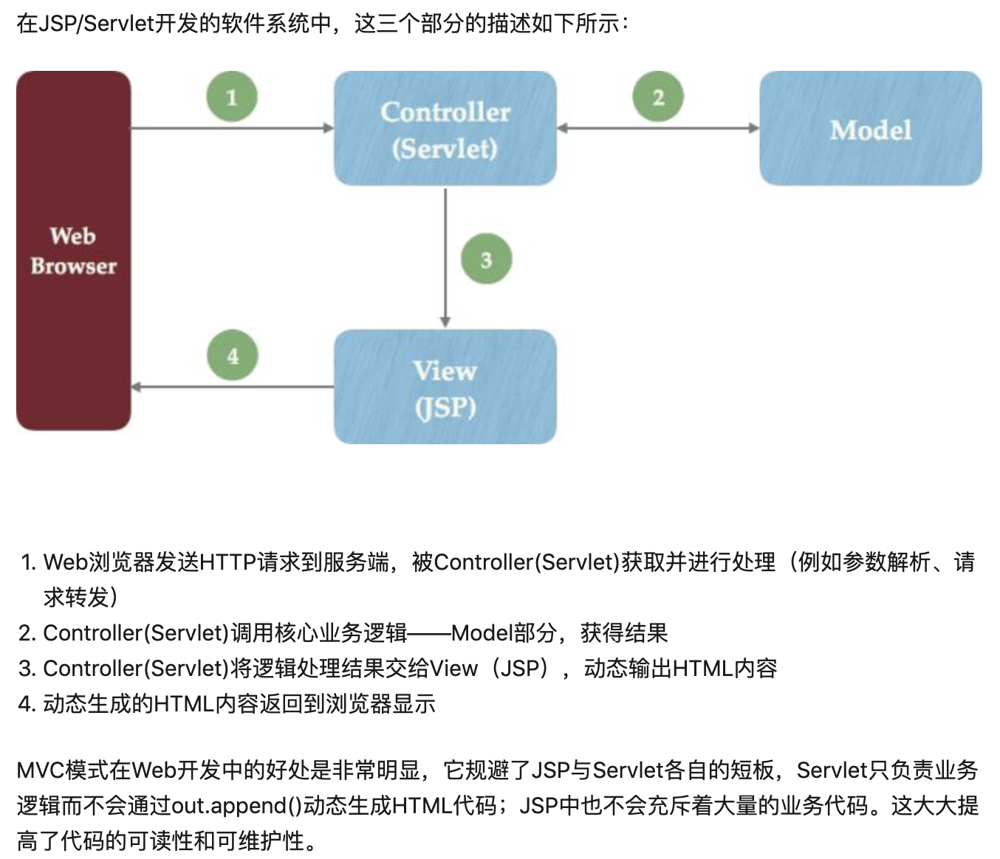
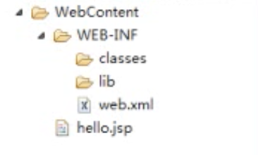

# JavaWeb

## 1. Java WEB 概述

> 1. Java Web 官方解决方案（官方架构）：
>
>    * Model2 结构，使用了 Servlet + JavaBean (EJB) + JSP。
>
>    * 但是目前主流的开发架构并非官方给出的架构，而是开源框架，典型代表：Struts、Spring 和 Hibernate，简称SSH。
>
> 2. J2EE 包含的技术：
>
>    * Servlet
>    * EJB
>    * JSP
>    * JDBC
>
> 3. JSP 和 Servlet 不同之处：
>    * Servlet 在 Java 代码中通过 HttpServletResponse 对象动态输出 HTML 内容。
>    * JSP 在静态 HTML 内容中嵌入 Java 代码，Java 代码被动态执行后生成 HTML 内容。
>    * jsp 就是在 html 里面写 java 代码，servlet 就是在 java 里面写 html 代码…其实 jsp 经过容器解释之后就是 servlet。
>
> 


## 2. MVC 设计模式


## 3. XML & Tomcat

> Tomcat 和 apache 的区别：
>
> * apache 是支持静态页的 WEB 服务器，而 Tomcat 是支持动态的（支持 JSP）。
> * apache 是用 C/C++ 编写的，而 Tomcat 是 Java 编写的。
> * apache 是 WEB 服务器，而 Tomcat 是应用服务器，两者是独立运行的，但都是 apache 组织开发的。
> * apache + Tomcat + JDK 组成的支持 JSP 的 WEB 服务器，如果客户端请求的是静态页面，则只需要 apache 服务器响应请求 如果客户端请求动态页面，则是Tomcat服务器响应请求。

### 3.1 Tomcat 目录结构



注释：classes 文件夹中放我们编写的 java 文件编译出来的 .class 文件，lib 放 jar 包，web.xml 是服务器的配置文件。


## 4. HTTP

> HTTP (Hypertext Transfer Prototype)

1. 数据格式：
   * 请求行 / 请求头 / 请求体
   * 响应行 / 响应头 / 响应体

2. GET 和 POST 请求的区别
   * POST: 
     - 以流的形式传递数据，不会再地址栏上显示。
     - 一般客户端向服务器提交数据都用 POST，不用 GET。
   * GET: 
     - 会在地址栏中拼接数据，有安全隐患，一般从服务器获取数据，而且客户端不需要提交数据的时候用。
     - 拼接的数据有限制，1kb。

## 5. Servlet

1. WEB 资源: 有两种分类： 静态 / 动态。
   * 静态： HTML / JavaScript / CSS
   * 动态： JSP (Java Server Pages)

> Servlet 是什么：
>
> * Servlet 是一个 Java 程序，运行在我们的 web 服务器（Tomcat 服务器）上，用于接收和响应 客户端的 http 请求。 
> * 更多的是配合动态资源来做。 当然静态资源也需要使用到 servlet，只不过是 Tomcat 里面已经定义好了一个 DefaultServlet。

2. 如何搭建一个 Tomcat 服务器 （使用 Eclipse 搭建一个简单的 WEB 工程）

   ````
   http://loclhost:8080/HelloWeb/index.html
   网址 		/ 项目名	 / 	子网页
   ````

3. 在 Web 工程上创建一个类，实现 Servlet 接口。

   * 配置 Servlet, 告诉服务器我们的服务器有这么些个 Servlet。
   * 配置文件： web.xml

   ````
   <servlet>
   	<servlet-name>HelloServlet02</servlet-name>
   	<servlet-class>com.itheima.servlet.HelloServlet</servlet-class>
   </servlet>
   <servlet-mapping>
   	<servlet-name>HelloServlet02</servlet-name>
   	<url-pattern>/a</url-pattern>
   </servlet-mapping>
   ````

   * http://loclhost:8080/HelloWeb/a

4. Servlet 通用写法

   * Servlet --> GenericServlet --> HttpServlet(用于处理http	请求)
   * 一般继承 HttpServlet, 并重写 doPost 和 doGet 方法。

5. Servlet 生命周期方法（从初始化到销毁）

   * **init 方法**: 创建该 Servlet 实例时调用，一个 servlet 只会初始化一次。
   * **service 方法**：重要客户端来了一个请求，就执行该方法。一个请求对应一个 service 方法。
   * **destroy 方法**：servlet 被销毁时执行。
     - 该 servlet 从 Tomcat 中移除
     - 正常关闭 Tomcat 服务器

6. 让 init 方法提前执行（在访问该 servlet 之前创建实例）

   * ``<load-on-startup>``中的数字越小，启动时机越早。

   ````
   <servlet>
     	<servlet-name>HelloServlet04</servlet-name>
     	<servlet-class>com.itheima.servlet.HelloServlet04</servlet-class>
     	<load-on-startup>2</load-on-startup>
   </servlet>
   ````

7. ServletConfig

   * 在使用别人开发的 servlet 时，需要自己配置 web.xml（注册该 servlet），并写入初始化时的参数。
   * 在开发 servlet 时，使用 ServletConfig 来获取用户写入的初始化参数。


### 5.1 HttpServletRequest 

1. Servlet 路径配置

    

2. Servlet Context （Servlet 上下文）

   > 每个 JVM 中的 每个 Web 工程都只有一个 ServletContext 对象，不管在哪个 Servlet 中获取都是同一个对象（指向同一个类型地址）。

   * 获取对象：``ServletContext context = getServletContext();``
   * 用来获取全局变量，任何 servlet 都可以获取 --> 对应 ServletConfig 获取单个 servlet 变量
   * 作用：
     * 获取全局配置参数
     * 获取web工程中的资源
     * 存取数据，servlet间共享数据  域对象
   * 


### 5.2 HttpServletResponse


## 6. JSP

> JSP 和 JavaScript 的区别：
>
> * JSP 技术是 WEB 网站的服务端技术，可以简单理解为 JSP 技术说是用来生成动态网页的。普通的网页是 HTML 的，它是静态的，需要事先用 HTML 语言编写好。那么我们在 HTML 页面中加入一些 Java 代码，用 Java 代码部分动态的内容插入到原来的 HTML 页面中，那么，这个页面就可以成为 JSP 页面。即，JSP = HTML + Java。
> * JavaScript 是 WEB 的客户端技术，它是一种脚本语言，不用编译，由浏览器解释执行。它也是插入在 HTML 页面当中。JavaScript 脚本的执行都是事件驱动的，当浏览器加载完 HTML 页面之后，用户点击页面中的按钮或者文本框的时候，如果页面中为这些按钮或文本框写好了响应事件 JavaScript 的脚本，那么用户在做响应动作时就会触发这些脚本的执行。JavaScript 脚本可以不与服务端进行通信，就对客户的动作作出响应。


