# JavaWeb

## JavaWeb 概述

> 1. Java Web 官方解决方案（官方架构）：
>
>    * Model2 结构，使用了 Servlet + JavaBean (EJB) + JSP。
>
>    * 但是目前主流的开发架构并非官方给出的架构，而是开源框架，典型代表：Struts、Spring 和 Hibernate，简称SSH。
>
> 2. J2EE 包含的技术：
>
>    * Servlet
>    * EJB
>    * JSP
>    * JDBC


## Tomcat

> **Tomcat 和 apache 的区别：**
>
> * apache 是支持静态页的 WEB 服务器，而 Tomcat 是支持动态的（支持 JSP）。
> * apache 是用 C/C++ 编写的，而 Tomcat 是 Java 编写的。
> * apache 是 WEB 服务器，而 Tomcat 是应用服务器，两者是独立运行的，但都是 apache 组织开发的。
> * apache + Tomcat + JDK 组成的支持 JSP 的 WEB 服务器，如果客户端请求的是静态页面，则只需要 apache 服务器响应请求 如果客户端请求动态页面，则是Tomcat服务器响应请求。

### Tomcat 目录结构


注释：classes 文件夹中放我们编写的 java 文件编译出来的 .class 文件，lib 放 jar 包，web.xml 是服务器的配置文件。

**如何搭建一个 Tomcat 服务器** （使用 Eclipse 搭建一个简单的 WEB 工程）

````
http://loclhost:8080/HelloWeb/index.html
网址 		/ 项目名	 / 	子网页
````


## Servlet

> **Servlet 是什么**：
> Servlet 是一个 Java 程序（组件），运行在我们的 web 服务器上（服务器负责Sevelet和客户的通信以及调用Servlet的方法），Servlet和客户的通信采用“请求/响应”的模式。 

**Servlet 能做的事**：
  - 创建并返回基于客户请求的动态HTML页面。
  - 创建可嵌入到现有HTML页面中的部分HTML页面。
  - 与其他服务器资源进行通信（比如数据库或者基于Java的应用程序）。


**注意**：Servelt容器掌控着 Servlet 的生命周期。


### 如何创建一个 Servlet （helloworld）

1. 在 Web 工程上创建一个类，实现 Servlet 接口。

2. 在 web.xml 中配置和映射这个 Servlet（因为希望可以通过浏览器来调用这个 java 类，所以需要映射）。

````xml
<servlet>
  <!-- Servlet 注册的名字-->
	<servlet-name>HelloServlet</servlet-name>
  <!-- Servlet 的全类名-->
	<servlet-class>com.ning.bei.HelloServlet</servlet-class>
</servlet>

<servlet-mapping>
  <!-- 需要和某一个Servlet节点的servlet-name子节点的文本节点一致-->
	<servlet-name>HelloServlet</servlet-name>
  <!-- 映射具体的访问路径：/ 代表当前的 web 应用的根目录-->
	<url-pattern>/hello</url-pattern>
</servlet-mapping>
````

3. **http://loclhost:8080/HelloWeb/**hello（加粗为根目录，通过url映射找到全类名，然后找到对应的java文件）

### Servlet 容器

运行Servlet、JSP、Filter等软件环境：

1. 可以用来创建Servlet，并调用Servlet的相关生命周期方法。
2. JSP，Filter，Listener，Tag....

### Servlet 生命周期方法

以下方法都是由servlet容器负责调用。

- **构造器**：只被调用一次。只有第一次请求Servlet时，创建Servlet实例，调用构造器。这说明Servlet是单例的！（有线程安全问题）

- **init 方法**：只被调用一次。在创建好实例后立即被调用。用于初始化当前Servlet。
- **service 方法**：被多次调用。每次请求都会调用 service 方法，实际用于响应请求。
- **destroy 方法**：只被调用一次。在当前Servlet所在的web应用被卸载前调用，用于释放当前servlet所占用的资源。

### load-on-startup参数

1. 配置在servlet节点中

````xml
<servlet>
  	<servlet-name>HelloServlet</servlet-name>
  	<servlet-class>com.ning.bei.HelloServlet</servlet-class>
  	<load-on-startup>2</load-on-startup>
</servlet>
````

2. 可以指定servlet被创建的时机，若为负数，则在第一次请求时被创建，若为0或正数，则在web应用被servlet容器加载时被创建，且数值越小越早被创建。

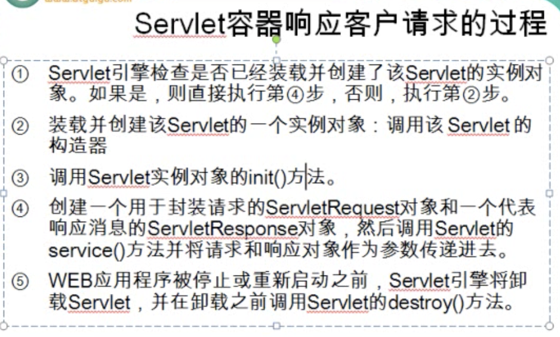

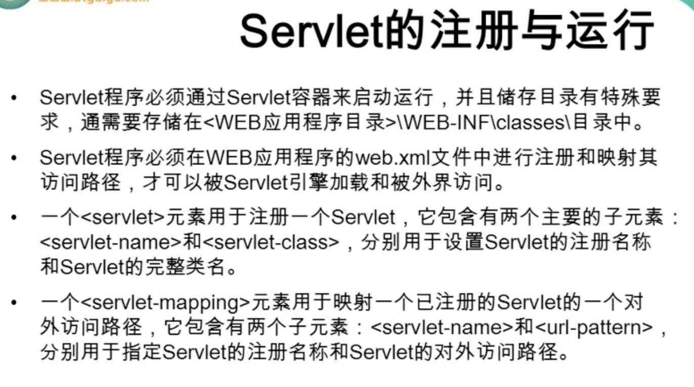

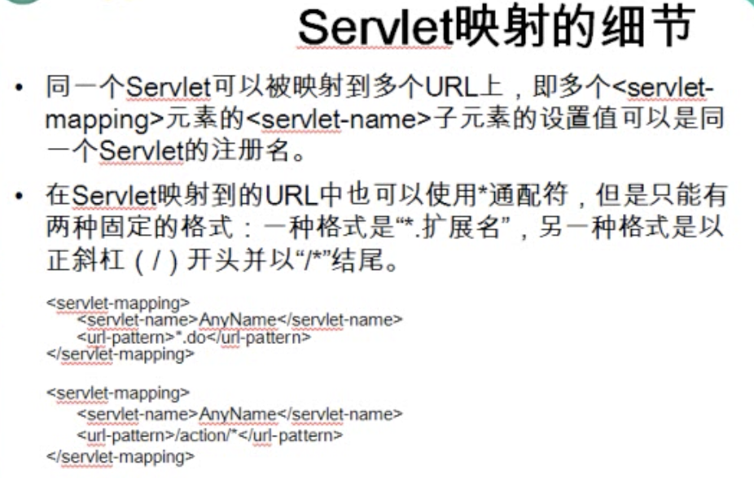

``*.扩展名`` 表示以扩展名结尾的url都调用这个servlet。


### ServletConfig 接口

ServletConfig 是做为传入参数传入到 init 方法中的。

1. 封装了servlet的配置信息，并且可以获取 ServletContext 对象（getServletContext()）。

````xml
<!-- 配置 Servlet 的初始化参数，且节点必须在 load-on-startup 节点的前面 -->
<init-param>
  <!-- 参数名 -->
  <param-name>user</param-name>
  <!-- 参数值 -->
  <param-value>root</param-value>
</init-param>
````

2. 获取当前servlet的初始化参数：
   - getInitParameter(String name)：获取指定参数名的初始化参数。
   - getInitParameterNames()：获取参数名组成的 Enumeration。

> - 在使用别人开发的 servlet 时，需要自己配置 web.xml（注册该 servlet），并写入初始化时的参数。
> - 在开发 servlet 时，使用 ServletConfig 来获取用户写入的初始化参数。

### ServletContext 类

1. 可以由 ServletConfig 获取 ``ServletContext sc = servletConfig.getServletContext();`` 

2. 该对象代表当前 WEB 应用：可以认为 ServletContext 是当前web 应用的大管家，可以获取到当前 web 应用的各个方面的信息。

  - 获取当前 web 应用的初始化参数:
    1. 配置初始化参数：（可以为所有的servlet获取，而servlet的初始化参数只能是那个servlet可以获取）
   ````xml
   <!-- 配置当前 web 应用的初始化参数 -->
   <context-param>
     <param-name>driver</param-name>
     <!-- 参数值 -->
     <param-value>com.mysql.jdbc.Driver</param-value>
   </context-param>
   ````

    2. 方法：
      getInitParameter(String name)
      getInitParameterNames()

  - 获取当前web应用的某一个文件在服务器上的绝对路径，而不是部署前的路径：getRealPath(String path)；
  
  - 获取当前web应用的名称：getContextPath(); ``/note.txt``

  - 获取当前web应用的某一个文件对应的输入流：getResourceAsStream(String path): path 的 / 为当前web应用的根目录（和 classLoader 的获取路径有所区别）。

  - 和 attributes 相关的几个方法。


### HTTP

浏览器和 web 服务器之间的连接过程是短暂的，每次连接只是处理一个请求和响应。对每一个页面的访问，浏览器和 web 服务器都要简历一次单独的连接。

浏览器到 web 服务器之间的所有通讯都是完全独立分开的请求和响应对。（例如，加载一个页面，包含三张图片，实际上需要四次连接用来传输三张图片和这页文档）

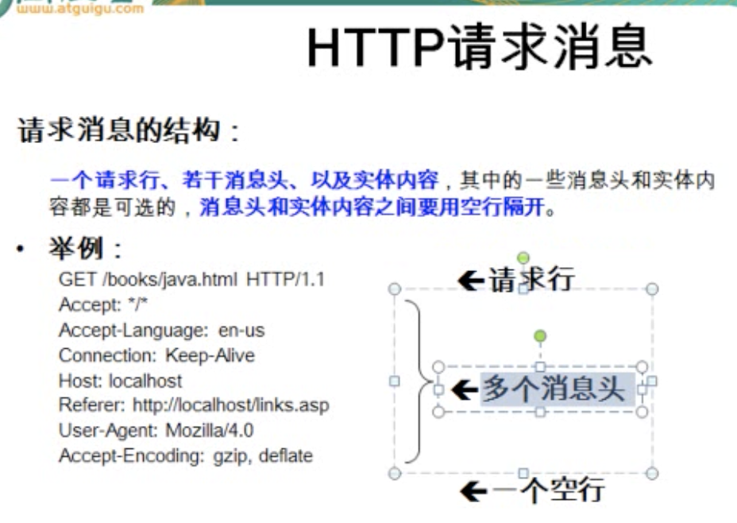

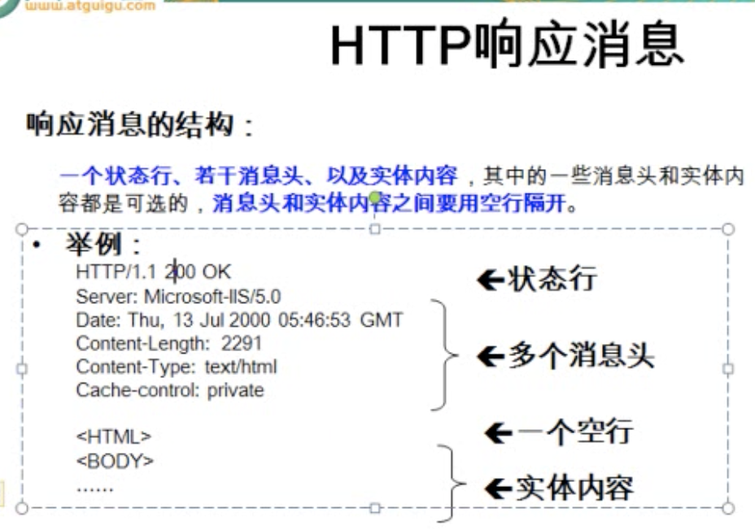


### 使用 GET 方式传递参数：

1. 在浏览器地址栏中输入某个 url 地址或单击网页上的一个超链接时，浏览器发出的 HTTP 请求消息的请求方式为 GET。
2. 如果在网页中的<form> 表单元素的 method 属性被设置成了 “GET”，浏览器提交这个 form 表单时生成的http请求消息的请求方式也是 GET。
3. 使用 GET 请求方式给 web 服务器传递参数的格式：http://www.ning.com/counter.jsp?name=user&password=123
4. 传送的数据量一半限制在 1kB 以下。

### 使用 POST 方式传递参数：

1. POST 请求方式主要用于向 web 程序提交 form 表单中的数据：form 表单的method 设置为 POST。
2. POST 方式将各个表单的字段元素及其数据作为 http消息的尸体内容发送给 web 服务器，传送的数据量要比使用 GET 方式传送的数据量要大很多。

### 如何在 Servlet 中获取请求信息

1. **Servlet 的 service() 方法用于应答请求**：因为每次请求都会调用该方法。service 方法有两个参数：（这两个接口的实现类都是服务器实现的，并在服务器调用 service 方法时传入）
  - ServletRequest：封装了请求信息，可以从中获取任何的请求信息。
  - ServletResponse：封装了响应信息，使用该接口的方法实现给用户具体的响应。

2. **ServletRequest**：

  - **获取请求参数**：

    - String **getParameter(String name)**：根据请求参数的名字，返回参数值。若请求参数有多个值，如 checkbox，该方法只能获取第一个值。
    - String[] **getParameterValues(String name)**：根据请求参数的名字，返回请求参数对应的字符串数组。
    - Map **getParameterMap()**：返回请求参数的健值对：key：参数名，value：参数值，String数组类型。
    - Enumeration **getParameterNames()**：返回参数名对应的 Enumeration 对象，类似于 ServletConfig（或 ServletContext）的getInitParameterNames() 。

  - 和 attribute 相关的几个方法

3. **HttpServletRequest**：是 ServletRequest 的子接口，是针对 HTTP 请求所定义的，其中包含了大量获取 HTTP 请求相关的方法。(将 servletRequest 强转成 HttpServletServletRequest，``HttpServletRequest hsr = (HttpServletRequest) request;`` )

  - **getRequestURI()**：获取请求的URL.

  - **getMethod()**：获取请求的方式.

  - **getQueryString()**：若是一个 GET 请求，获取请求参数对应的那个字符串，即 ？后面的字符串。

  - **getServletPath()**：获取请求的 Servlet 的映射路径.

4. **ServletResponse**：

  - **getWriter()**：返回PrintWriter 对象，调用该对象的 print() 方法，将把 print() 中的参数直接打印到浏览器上。

  - **setContentType(String Type)**：设置响应的内容类型.

  - **sendRedirect(String location)**:请求的重定向。（此方法为 HttpServletResponse 中定义，需进行强转）


### GenericServlet（了解）

- 首先是一个 Servlet，实现了 Servlet 接口和 ServletConfig 接口，但是是一个抽象类，其中的 service 方法是抽象方法。

- 如果新建的 Servlet 程序直接继承 GenericServlet 会是开发更加简洁。

- 具体实现：
  1.  在GenericServlet 中声明了一个 ServletConfig 类型的成员变量，在 init(ServletConfig) 方法中对其进行了初始化，利用 servletConfig 成员变量的方法实现了 ServletConfig 接口的方法。

  2. 还定义了一个 init() 方法，在 init(ServletConfig) 方法中对其进行了调用，子类可以直接覆盖 init() 在其中实现对 Servlet 的初始化。

  3. 不建议直接覆盖 init(ServletConfig)，因为如果忘记编写 super.init(ServletConfig)，而还是用了 ServletConfig 接口的方法，则会出现空指针异常。

  4. 新建的 init(){} 并非 Servlet 的生命周期方法，而 init(ServletConfig) 是生命周期相关的方法。


### HttpServlet（重要）

- 首先是一个 Servlet，继承自 GenericServlet，针对 HTTP 协议所定制。

- 在 service() 方法中直接把 ServletRequest 和 ServletResponse 转为 HttpServletRequest 和 HttpServletResponse，并调用了重载的 service(HttpServletRequest，HttpServletResponse)

- 在 service(HttpServletRequest，HttpServletResponse) 中获取了request.getMethod()，根据请求方式又创建了 doXxx() 方法（Xxx 代表具体的请求方式，比如 doPost 和 doGet）

- **实际开发中，直接继承 HttpServlet，并根据请求方式重写 doXxx() 方法即可**。

- 好处：直接有针对性地覆盖 doXxx() 方法；直接使用 HttpServletRequest 和 HttpServletResponse，不需要强转。


## JSP（Java Server Page）

> **JSP 和 JavaScript 的区别：**
>
> * JSP 技术是 WEB 网站的服务端技术，可以简单理解为 JSP 技术说是用来生成动态网页的。普通的网页是 HTML 的，它是静态的，需要事先用 HTML 语言编写好。那么我们在 HTML 页面中加入一些 Java 代码，用 Java 代码部分动态的内容插入到原来的 HTML 页面中，那么，这个页面就可以成为 JSP 页面。即，JSP = HTML + Java。
> * JavaScript 是 WEB 的客户端技术，它是一种脚本语言，不用编译，由浏览器解释执行。它也是插入在 HTML 页面当中。JavaScript 脚本的执行都是事件驱动的，当浏览器加载完 HTML 页面之后，用户点击页面中的按钮或者文本框的时候，如果页面中为这些按钮或文本框写好了响应事件 JavaScript 的脚本，那么用户在做响应动作时就会触发这些脚本的执行。JavaScript 脚本可以不与服务端进行通信，就对客户的动作作出响应。

> **JSP 和 Servlet 不同之处：**
>
> * Servlet 在 Java 代码中通过 HttpServletResponse 对象动态输出 HTML 内容。
> * JSP 在静态 HTML 内容中嵌入 Java 代码，Java 代码被动态执行后生成 HTML 内容。
> * jsp 就是在 html 里面写 java 代码，servlet 就是在 java 里面写 html 代码…其实 jsp 经过容器解释之后就是 servlet。

### JSP 概述

1. **什么是 JSP ？**

  JSP 是简 Servlet 编写的一种技术，它将 Java 代码和 HTML 语句混合在同一个文件中编写，只对网页中的要动态产生的内容采用了 Java 代码来编写，而对固定不变的静态内容采用了普通静态 HTML 页面的方式编写。

2. **写一个 helloworld：**
新建一个 JSP 页面，在 body 节点中的 <% %> 内即可编写 Java 代码。

````html
<body>
  <%
    System.out.println("helloworld");  
  %>
</body>
````

3. JSP 可以放在 web 应用程序中的除了 WEB-INF 及其子目录外的其他任何目录中，JSP 页面的访问路径和普通 HTML 页面的访问路径形式也完全一样。

### JSP 的运行原理
JSP 的本质是一个 Servlet（去找 JSP 翻译后的那个 .java 文件）。每一个 JSP 页面中在第一次被访问时 JSP 引擎会将它翻译成一个 Servlet 源程序，接着把这个 Servlet 源程序编译成 Servlet 的 class 类文件，然后再由 web 容器像调用普通 Servlet 程序一样的方式来装在和解释执行这个由 JSP 页面翻译成的 Servlet 程序。

### JSP 页面的隐含变量

可以用到 request，response，pageContext，session，application，config，out，page 这8个隐含对象（实际上还可以使用一个叫 expection 的隐含对象）。所以 JSP 页面有总共9个隐含对象。

**注：**没有声明就可以使用的对象叫隐含对象

隐含变量描述：

  - **request**: HttpServletRequest 的一个对象。

  - response：HttpServletResponse 的一个对象（在 JSP 页面中几乎不会调用这个对象的人和方法）。

  - **pageContext**：JSP 页面的上下文，是 PageContext 的一个对象，可以从该对象中后去到其他8个隐含对象，也可以从中获取到当前页面的其他信息（自定义标签中会使用）。

  - **session**：代表浏览器和服务器的一次回话，是 HttpSession 的一个对象。

  - **application**：代表当前 web 应用，就是 ServletContext 对象。

  - config：是当前 JSP 对应的 Servlet 的 ServletConfig 对象（几乎不使用）。若需要访问当前 JSP 配置的初始化参数，需要通过映射的地址才可以。
    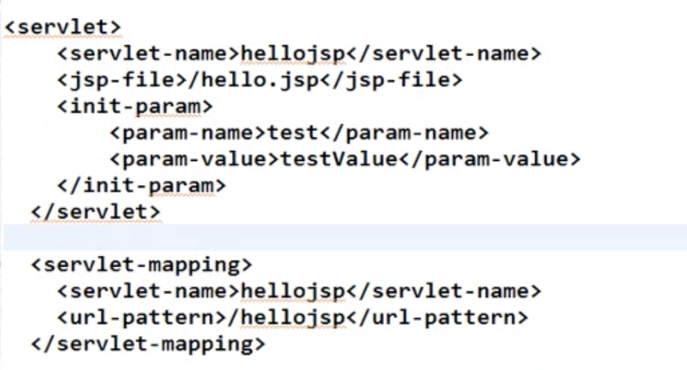

  - **out**：JspWriter 对象，调用 out.println() 可以直接把字符串打印到浏览器上。

  - page：指向当前 JSP 对应的 Servlet 对象的引用，但为 Object 类型，只能调用 Object 类的方法（几乎不使用）。

  - **expection**：在声明了 page 指令的 isErrorPage=“true” 时才可以用。

**注：**

  - 以上粗体对象经常用。
  - pageContext，request，session，application（对属性的作用域从小到大）。


### JSP 表达式（JSP Expression）
JSP Expression 提供了将一个 Java 变量或表达式的计算结果输出到客户端的简化方式，它将要输出的变量或表达式直接封装在 ``<%=`` 和 ``%>`` 之中。

### JSP 脚本片断（scriptlet）
JSP 脚本片断（scriptlet）是指嵌套在 ``<%`` 和 ``%>`` 之中的一条或多条 Java 程序代码。多个脚本片断中的代码可以相互访问。

### JSP 声明
JSP 声明将 Java 代码封装在 ``<%!`` 和 ``%>``之中，它里面的代码将被插入进 Servlet 的 ``_jspServlet`` 方法外面。(几乎从不这样使用，直到即可)

### JSP 注释
``<%--  JSP注释 --%> <!-- HTML 注释 -->``
JSP 注释可以阻止 java 代码执行，html注释则不行。

### JSP 指令

JSP指令是为JSP引擎设计的，并不直接产生任何可见的输出，而只是告诉引擎如何处理 JSP 页面中的其余部分。

``<%@ 指令 属性名="值" %>``

举例：``<%@ page contentType="text/html;charset=gb2312" %>``

**注意**：属性名是大小写敏感的；目前有三种指令：page、include、taglib；一条指令可以定义多个属性。

#### page指令

page指令合集：(建议放在页面开头，作用于整个页面)

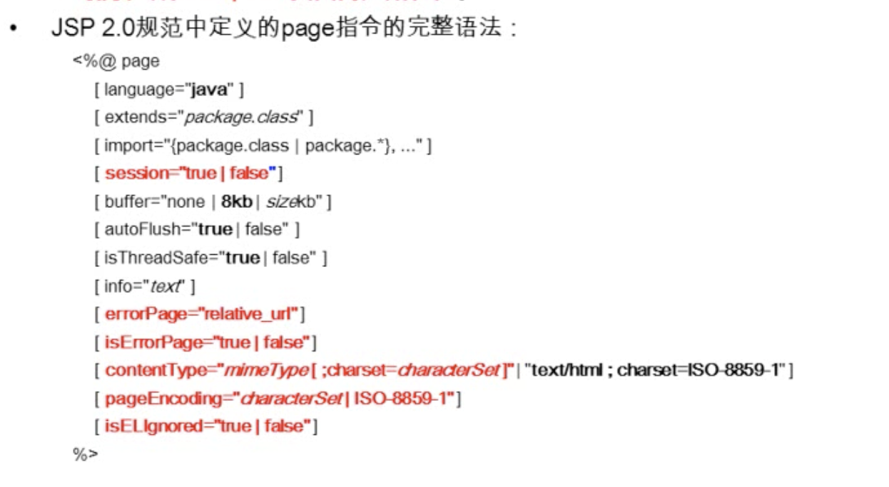

常见属性：

- **import**：指定当前 JSP 页面对应的 Servlet 需要导入的类，``<%@page import="java.text.DateFormat"%>``；

- **session**：取值为 true 或 false，指定当前页面的 session 隐含变量是否可用，或者说访问当前页面是否一定生成 HttpSession 对象；

- **errorPage**：指若当前页面出现错误的实际响应页面是什么，其中 / 表示的是当前 web 应用的根目录``<%@page errorPage="/error.jsp"%>``；

- 在响应 error.jsp 时，jsp 引擎使用的是*<u>请求转发</u>*的形式。

- **isErrorPage**：指定当前页面是否为错误处理页面，可以说明当前页面是否可以使用 exception 隐含变量，注意：若该属性设置为 true，并可以使用 exception，一般不建议能直接访问该页面。

- 如何让客户不能直接访问某一个页面呢？对于 Tomcat 服务器，WEB-INF 下的文件是不能通过在浏览器地址栏直接输入url来访问的，但是通过请求的转发来访问是可以的。

- 还可以在 web.html 中指定错误页面。

  - ````xml
    <error-page>
      <!-- 指定出错的代码：404没有指定的资源，500内部错误 -->
    	<error-code>500</error-code>
       <!-- 指定响应页面的位置 -->
      <location>/WEB-INF/error.jsp</location>
    </error-page>
    
    <error-page>
       <!-- 指定异常的类型 -->
    	<exception-type>java.lang.ArithmeticException</exception-type>
      <location>/WEB-INF/error.jsp</location>
    </error-page>
    ````

  - 

- **contentType**：指定当前 JSP 页面的响应类型，实际调用的是 ``response.setContentType("text/html;charset=UTF-8")``。通常情况下，对于 JSP 页面而言其取值均为 ``text/html;charset=UTF-8``。charset 指定但会的页面的字符的编码是什么，通常是 UTF-8。

- **pageEncoding**：指定当前 JSP 页面的字符编码，通常该值和 contentType 中的 charset 一致。

- **isELIgnored**：指定当前 JSP 页面是否可以使用 EL 表达式，通常取值为 true。


#### include 指令

**静态引入**

include 指令用于通知 JSP 引擎在翻译当前 JSP 页面时将其他文件中的内容合并进当前 JSP 页面转换成的 Servlet 源文件中，这种在源文件级别进行引入的方式称之为**<u>*静态引入*</u>**或**<u>*静态包含*</u>**，当前 JSP 页面于静态引入的页面紧密结合为一个 Servlet。（源文件只有一个）

file 属性的设置值必须使用相对路径，如果使用 / 开头则表示相对于 web 应用的根目录，否则就是相对于该文件的路径。

举例：``<%@include file="b.jsp"%>``


#### JSP 标签

**jsp:include 动态引入**

并不是像 include 指令生成一个 Servlet 源文件，而是生成两个 Servlet 源文件，然后通过一个方法的方式把目标页面包含进来。（源文件有两个）

举例：``<jsp:include page="b.jsp"></jsp:include>``

> **include指令和 jsp:include 标签对比：**
>
> - ``<jsp:include> ``是当前 JSP 页面的执行期间插入被引入资源的输出内容，被动态引入的资源必须是一个能独立被 web 容器调用和执行的资源。
> - ``include指令``只能引入遵循 JSP 格式的文件，被引入的文件于当前文件共同被翻译成一个 Servlet 源文件。
> - 开发的时候用哪个都可以。

**jsp:forward 转发**

``<jsp:forward page="/include/b.jsp"></jsp:forward>``

相当于：

``<% request.getRequestDispatcher("/include/b.jsp").forward(request,response); %>``

**jsp:param**

使用 jsp:forward 时可以使用 jsp:param 子标签，传入一些参数，jsp:include 同理。

````xml
<jsp:forward page="/include/b.jsp">
	<jsp:param value="123456" name="username"/>
</jsp:forward>
或者
<jsp:include page="/include/b.jsp">
	<jsp:param value="123456" name="username"/>
</jsp:include>
在 b.jsp 页面中可以通过 request.getParamter("username") 获取到传入的请求参数。
````


### 中文乱码问题

1. 在jsp页面上输入中文，在请求页面不出现乱码：保证 contentType="text/html; charset=UTF-8" 和 pageEncoding="UTF-8" charset 和 pageEncoding 的编码一致，且都支持中文。通常建议取值为 UTF-8。还需保证浏览器的显示字符编码和请求的JSP页面的编码一致即可。
2. 获取中文参数值：(默认参数在传输过程中使用的编码为 ISO-8859-1)
   1. 对于 POST 请求：只要获取请求信息之前，调用 ``request.setCharacterEncoding("UTF-8");`` 即可。
   2. 对于 GET 请求：前面的方式对 GET 无效；可以通过修改 Tomcat 的 server.xml 文件的方式。参照 https://localhost:8989/docs/config/index.html 文档的 useBodyEncodingForURI 属性， 为 Connector 节点添加 useBodyEncodingForURI = "true" 属性即可。


## 域对象的属性操作（重要）

### 和属性相关的方法
- Object **getAttribute**(String name)：获取指定的属性。
- Enumeration **getAttributeNames**()：获取所有的属性的名字组成的 Enumeration 对象。
- void **removeAttribute**(String name)：移除指定的属性。
- void **setAttribute**(String name, Object obj)：设置属性。

**注意**：pageContext，request，session，application对象都有这些方法！这四个对象也称之为域对象。

### 域对象的属性作用范围
- **pageContext：**属性的作用范围仅限于当前 JSP 页面。
- **request**：属性作用范围仅限于同一个请求。（在有转发的情况下可以跨页面获取属性值）
- **session**：属性作用范围仅限于一次会话（浏览器打开直到关闭称之为一次会话，在此期间绘画不失效）。
- **application**：属性作用单位限于当前 web 应用，是范围最大的属性作用范围，只要在一处设置属性，在其他各处的 JSP 和 Servlet 中都可以调用。


## 请求转发与重定向（重要）

本质区别：
请求的转发中浏览器只发出了一次请求，而重定向浏览器则发出了两次请求。

具体特点：（重要）
  1. 请求的转发：地址栏是初次发出请求的地址；
     请求的重定向：地址栏不再是初次发出的请求地址，地址栏为最后响应的那个地址。

  2. 请求转发：在最终的 Servlet 中，request 对象和中转的那个 request 是用一个对象；
     请求重定向：在最终的 Servlet 中，request 对象和中转的那个 request 不是用一个对象。

  3. 请求转发：只能转发给当前 web 应用的资源；
     请求重定向：可以重定向到任何资源。

  4. 请求的转发：/ 代表的是当前 web 应用的根目录；
     请求重定向：/ 代表的是当前 web 站点的根目录。

请求转发代码：
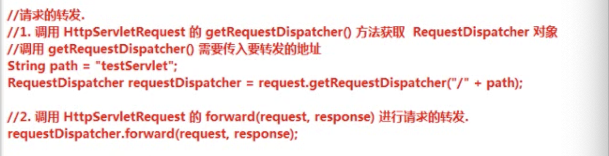

请求重定向代码：
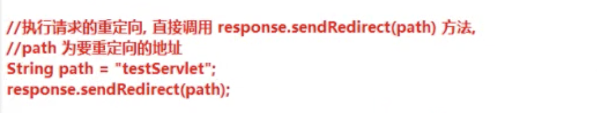

注意：当前 web 应用的根目录：http://localhost:xxxx/helloWeb/
     站点的根目录：http://localhost:xxxx/


## MVC 设计模式

### MVC 概述

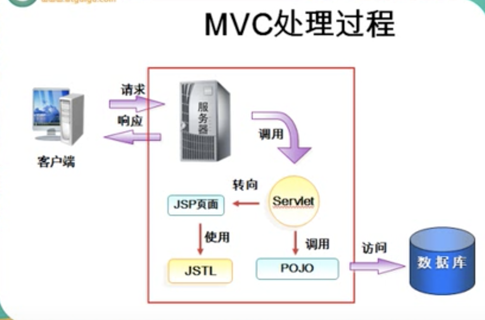
MVC （Model-View-Controller）是一种设计模式，它把应用程序分成三个核心模块：模块、视图、控制器，各自处理自己的任务。

**模型（Model）**：

  - 模型是应用程序的主题部分，代表业务数据和业务逻辑。
  - 一个模型能为多个试图提供数据。
  - 由于应用于模型的代码只需要写一次就可以被多个视图重用，所以提高了代码的可重用性。

**视图（View）**：

  - 试图是用户看到并与之交互的界面，作用如下：
    - 试图想用户显示相关的数据。
    - 接收用户的输入。
    - 部进行任何实际的业务处理。

 **控制器**：

  - 控制器接收用户的输入并调用模型和试图去完成用户的需求。
  - 控制器接收请求并决定调用哪个模型组件去处理请求，然后决定调用哪个视图来显示模型处理返回的数据。

 

### 案例一（查询）

通过网页中的一个超链接打开数据库中的学生列表信息，并返回到浏览器。

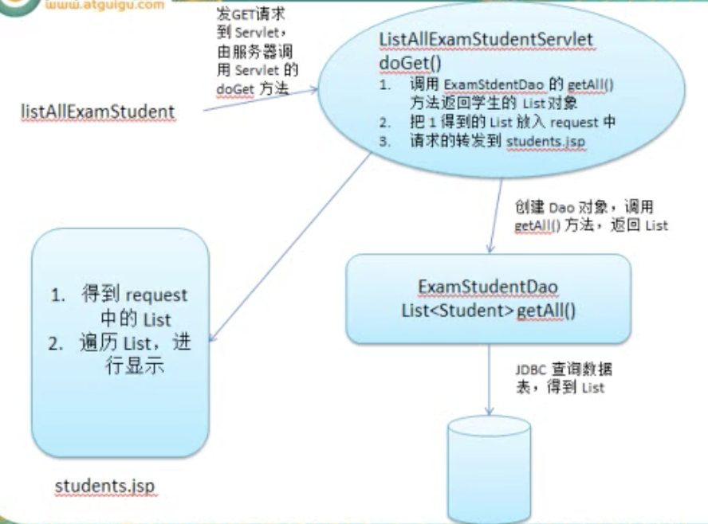


### 案例二（删除）

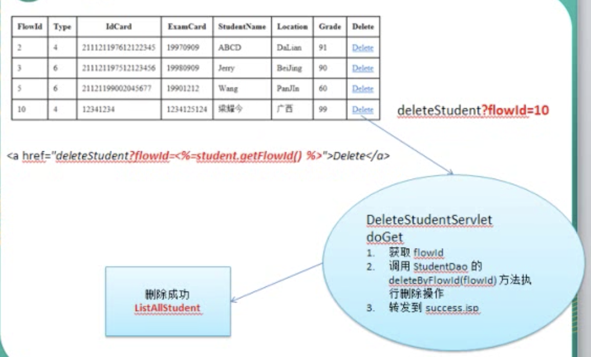


**小结：**

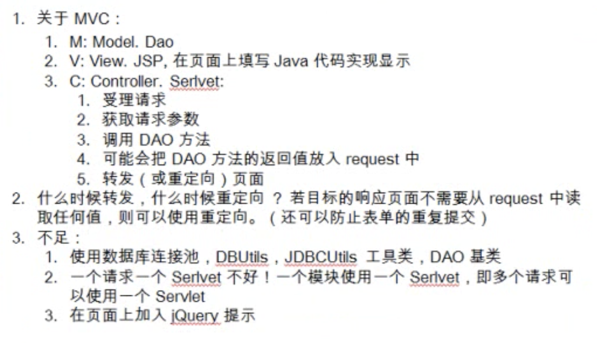

**什么时候转发，什么时候重定向？**

若目标的响应页面不需要从 request 中读取任何值，则可以使用重定向（还可以防止表单的重复提交）。


### 案例三 （架构分析）

要点分析：

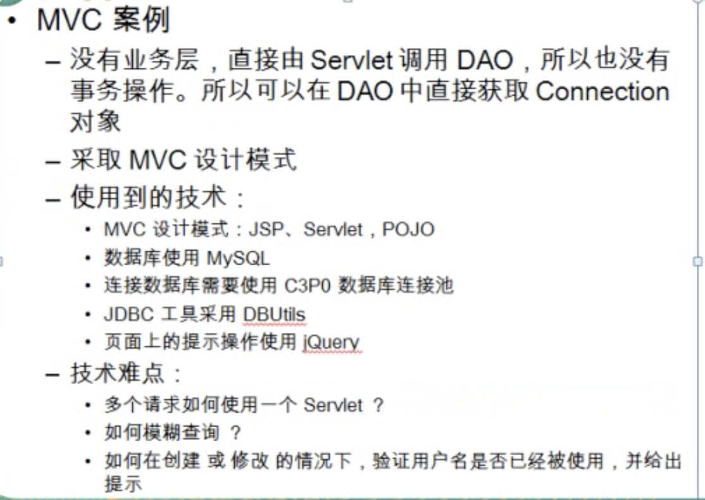


架构分析

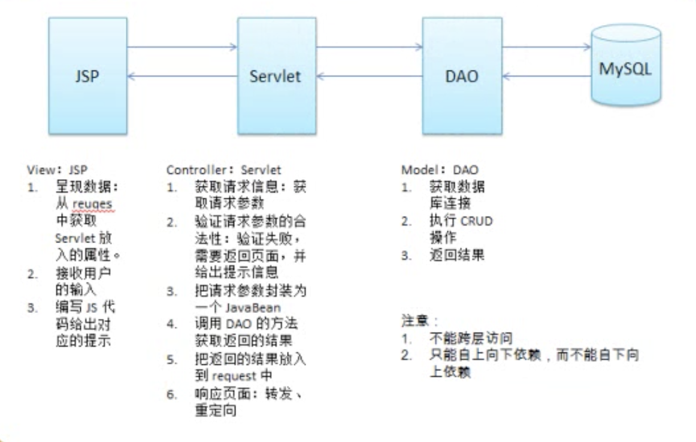


