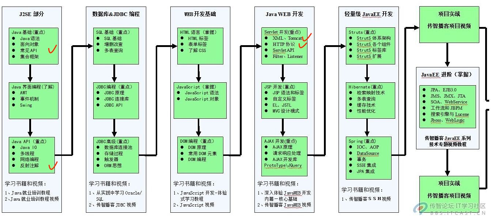
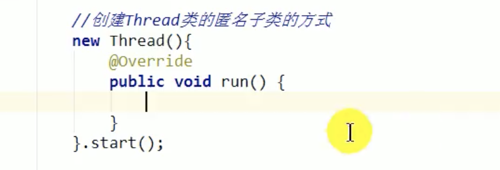
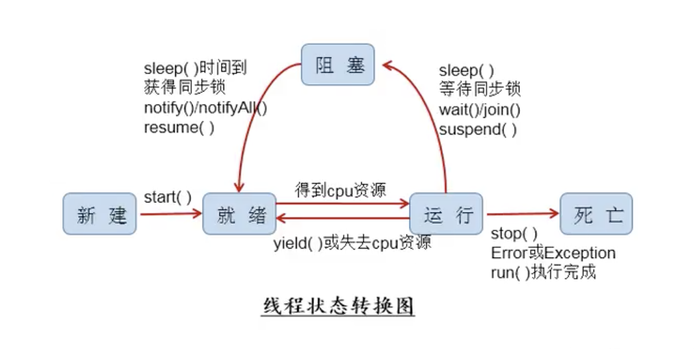
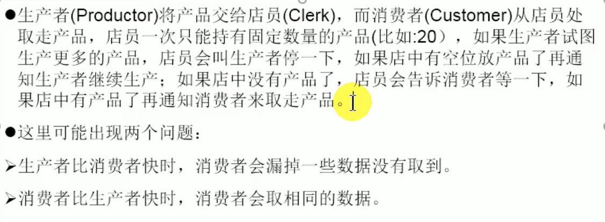
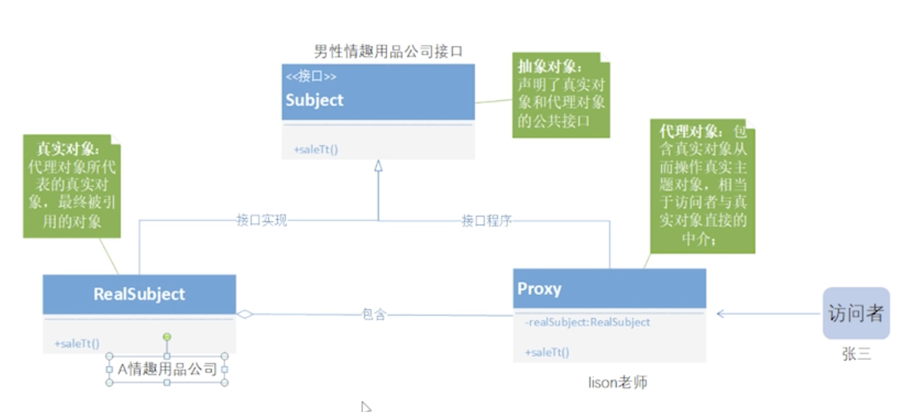
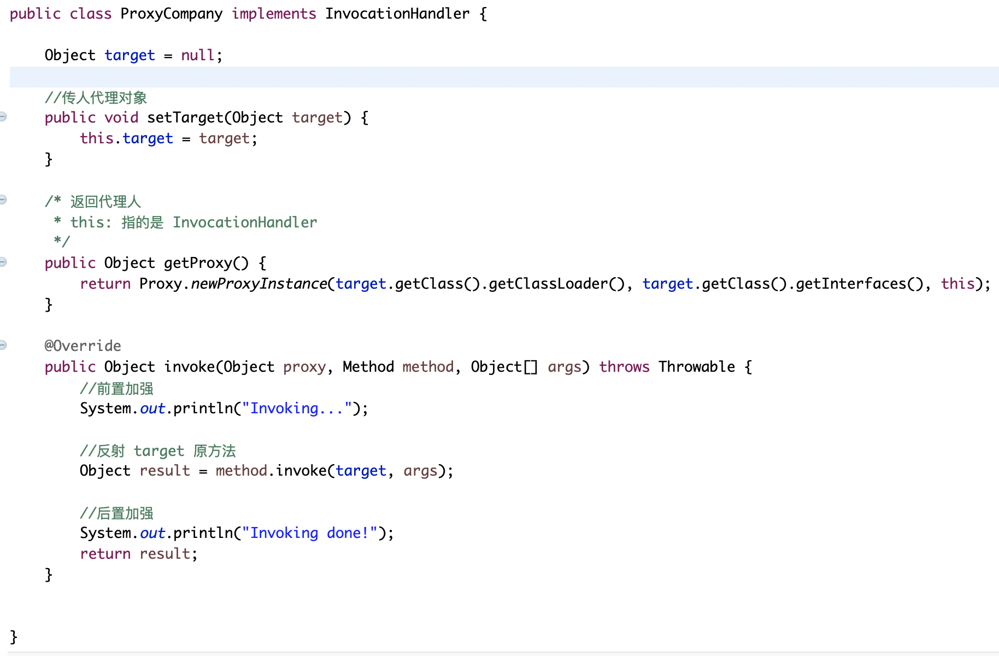
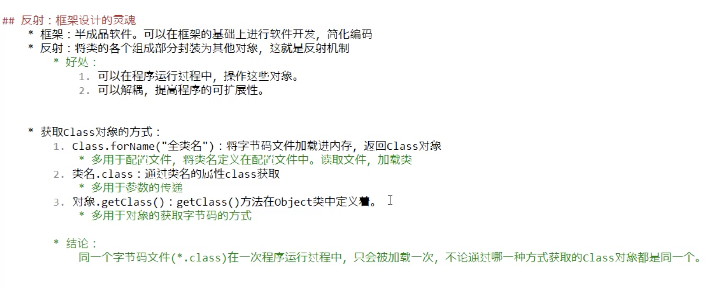
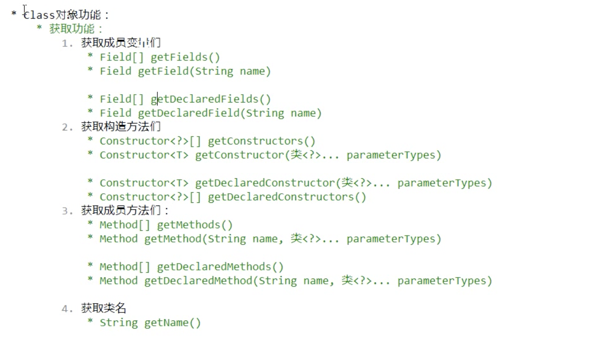
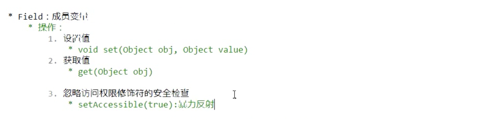
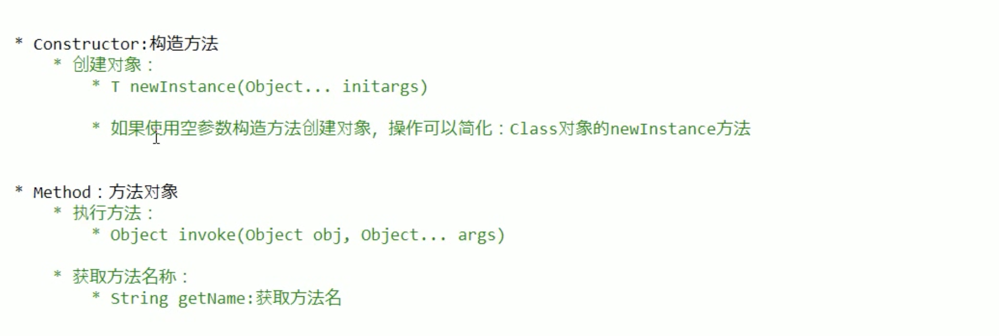

## Java Web 开发学习路径



## Java 语法基础/数据类型


## 异常

**注意**：
子类重写父类方法时，若父类方法没有抛异常，子类方法不可以抛，若父类方法有，子类抛的异常不可比父类大。


## 多线程

>**程序 program**：为了完成某个特定任务，用某种语言编写的一组指令集合，是一段静态的代码。
>
>**进程 process**：正在运行中的程序。
>
>- 存在生命周期，是动态的。
>- 系统会为每个进程分配不同的内存空间。
>
>**线程** **thread**：是一个程序内部的一条执行路径。
>
>- 线程是调度和执行的最小单位，每个线程都包含一个独立的运行栈和程序计数器，线程切换的开销小。
>- 一个进程中的多个线程共享相同的内存单元（堆和方法区），线程间的通信因此更加方便。但是因此会带来安全隐患。


### 单核 CPU 和多核 CPU 的理解

1. 单核和多核：
  - 单核 cpu 是一种假的多线程，在同一时间单元内，只能执行一个线程任务。
  - 多核能更好地发挥多线程的效率，现在的服务器都是多核的。
  - 一个 Java 应用程序，至少有三个线程，main()主线程、gc()垃圾回收线程、异常处理线程。如果发生异常，会影响主线程。

2. 并行和并发：
  - 并行：多个 cpu 同时执行多个任务。
  - 并发：一个 cpu 同时执行多个任务。

3. 使用多线程的优点（单核）：
  - 增强用户体验，提高应用程序的相应。
  - 提高cpu的利用率。
  - 改善程序结构，将又长又臭的进程分成不同的线程，利于理解。


### 线程的创建和使用

**测试 Thread 中的常用方法**：
  1. start()：启动当前线程；调用当前线程的 run 方法。
  2. run()：通常需要重写 Thread 类中的此方法，将创建的线程要执行的操作声明在此方法中。
  3. currentThread()：静态方法，返回执行当前代码的线程。
  4. getName()：获取当前线程的名字。
  5. setName()：设置当前线程的名字。如果想要给线程命名，可以用这个 setName()，或者在子类写一个构造器，将名字参数传给父类，因为父类也中有这样的专门用来命名的构造器。 ``public mythread(String name){ super(name)}``
  6. yield()：释放当前 cpu 的执行权。
  7. join()：在线程 A 中调用线程 B 的 join() 方法，此时 A 就会进入阻塞状态，直到 B 完全执行完以后，A 才会结束阻塞状态。
  8. stop()：强制停止线程，已过时。
  9. sleep(long millitime)：静态方法，暂停当前线程一段时间（ms）。
  10. isAlive()：判断当前方法是否存活。

**线程的调度方式**：
  1. 时间片
  2. 高优先级的线程抢占 cpu

**Java 的调度方法**：
  1. 同优先级线程组成先进先出队列（先到先得），使用时间片。
  2. 对于高优先级线程，使用优先调度的抢占式策略。（注意：优先级高只能说是率先执行的概率高，而不是说只有先执行完高优先级的线程执行完后再执行别的线程，存在高低线程交替执行的情况）

**线程的优先级**：
  1. 线程的优先级等级：
    - MAX_PRIORITY：10
    - MIN_PRIORITY：1
    - NORM_PRIORITY：5（默认是这个）
  2. 涉及的方法：
    - getPriority()：返回线程的优先级。
    - setPriority(int newPriority)：改变线程的优先级。

> 总共有四种方法创建多线程。

1. **方式一**：继承于 Thread 类

   - 创建一个继承 Thread 类的子类。
   - 重写（Override）Thread 类的 run() 方法 --> 将此线程执行的操作声明在 run() 中。
   - 创建子类的对象。
   - 通过该对象调用 start() 方法。（start() 方法是定义在 Thread 类中的：1. 启动当前线程 2. 调用当前线程的 run 方法）
     
**注意**：

  - 直接在 main 中调用 run 是不能启动多线程的，必须调用 start 方法。
  - 一个线程的 start 方法只能调用一次。
  - 如果一个 Thread 子类只用一次，可以考虑使用匿名内部类。

   

2. **方式二**：实现 Runnable 接口
  - 创建一个实现了 Runnable 接口的类。
  - 实现类去实现 Runnable 中的抽象方法：run()。
  - 将此对象作为参数传递到 Thread 类的构造器中，创建 Thread 类的对象（此时是多态的体现：``public Thread(Runnable target)``）。
  - 通过 Thread 类的对象调用 start()（实际上调用了 Runnable 中的 run() 方法）。

> **小结**：比较方式一和方式二
> 开发中，优先选择方式二
> 原因：
>   1. 实现的方式没有单继承兴的局限性。
>   2. 实现的方式更适合处理多个线程有共享数据的情况。
> 联系：public class Thread implements Runnable
> 相同点：两种方式都需要重写 run()，将线程要执行的逻辑声明在 run() 中。

3. **方式三**：实现 Callable 接口（jdk5.0新增）
  - 特点：有返回值；方法可以抛出异常；支持范型的返回值；需要借助 Future Task 类。
  - 实现过程：
    1. 创建一个实现 Callable 接口的类。
    2. 实现类实现 Callable 中的抽象方法 call(), 将此线程需要执行的操作声明在 call() 中。
    3. 创建 Callable 接口实现类的对象
    4. 将此实现类的对象作为传递值，传递到 FutureTask 的构造器中，创建 FutureTask 对象。
    5. 将 FutureTask 的对象作为参数传递到 Thread 类的构造器中，创建 Thread 类，调用 start() 方法。
    6. 获取 Callable 中call方法的返回值
````java
class myThread implements Callable<Object>{

  @Override
  public Object call() throws Exception{
    int result = 100;
    return result;
  }
}

public class ThreadNew {
  public static void main(String[] args) {
    myThread my = new myThread();
    FutureTask<Object> ft = new FutureTask<>(my);
    new Thread(ft).start();

    try{
      //get()返回值即为FutureTask构造器参数Callable实现类重写的call()方法的返回值
      Object obj = ft.get();
      System.out.println(obj);
    }catch(InterruptedException e){
      e.printStackTrace();
    }
  }
}
````

> 如何理解实现Callable接口比实现Runnable接口更强大？
>   1. 有返回值。
>   2. 方法可以抛出异常，被外面的操作捕获，获取异常信息。
>   3. 支持范型。

4. **方式四**：使用线程池
  - 思路：提前创建好多个线程，放入线程池中，使用时直接获取，使用完后放回池中。可以避免频繁创建销毁、实现重复利用。类似生活中的公共交通工具。
  - 好处：
    - 提高响应速度（减少了创建新线程的时间）；
    - 降低资源消耗（重复利用线程池中的线程，不需要每次都创建）；
    - 便于线程管理：
      - corePoolSize：核心池的大小
      - maximumPoolSize：最大线程数
      - keepAliveTime：线程没有任务时最多保持保持多长时间后会终止
  - 实现过程：
````java
class myThread1 implements Runnable{
  @Override
  public void run(){
    //...线程要做的事
  }
}

class myThread2 implements Runnable{
  @Override
  public void run(){
    //...线程要做的事
  }
}

public class ThreadPool {
  public static void main(String[] args) {
    //1.提供指定线程数量的线程池
    ExecutorService service = Executor.newFixedThreadPool(nThread:10);
    ThreadPoolExecutor sevice1 = (ThreadPoolExecutor) service1;

    //设置线程池的属性
    service1.setCorePoolSize(15);

    //2.执行指定的线程操作，需要提供实现Runnable接口或者Callable接口的对象
    service.execute(new mythread1());//适合用于 Runnable
    service.execute(new mythread2());//适合用于 Runnable
    //service.submit();//适合使用于 Callable

    //3.关闭连接池
    service.shutdown();
  }
}
````


### 线程的生命周期

Thread.State 类定义了线程的几种状态：
  1. 新建
  2. 就绪
  3. 运行
  4. 阻塞
  5. 死亡



### 线程的安全问题（同步问题）

**问题的提出**：
  1. 多线确程执行的不定性，会引起执行结果的不稳定。
  2. 多个线程对数据的共享，会造成操作的不完整性，会破坏数据。（当某个线程在操作数据时，其他线程参与进来，也来操作）

**如何解决**：
当线程 a 在操作共享数据时，其他线程不能参与进来，直到 a 操作完成后，其他线程才可以开始操作，这种情况下，即使 a 出现了阻塞，也不能被改变。

在 Java 中，我们通过同步机制来解决线程的安全问题。

**方式一**：同步代码块
````java
//形式：
synchronized(同步监视器){
  //需要被同步的代码
}

//方式一（实现 Runnable 方式）：
Object obj = new Object();
synchronized(obj){
  //被同步的代码
}
//方式二（实现 Runnable 方式）：
synchronized(this){
  //当确定该对象是唯一时，可以用 this
  //被同步的代码
}
//方式三（继承 Thread 方式）：
Object static obj = new Object();
synchronized(obj){
  //静态变量，保证锁唯一
  //被同步的代码
}
//方式四（继承 Thread 方式）：
synchronized(myThread.class){
  //类也可以当作锁，因为类也是一种对象，
  //被同步的代码
}
````
  1. 操作共享数据的代码，即为需要被同步的代码（包含太多代码容易造成执行效率低，有时还会导致错误）。
  2. 共享数据：多个线程共同操作的变量。
  3. 同步监视器：俗称，锁，任何一个类的对象都可以作为锁。（要求：多个线程必须共用同一把锁才能实现同步）
  4. **注意**：在继承方式创建多线程中，需要将锁定义为静态变量，保证锁是唯一的；在实现方式中，因为天然锁是唯一的，所以可以不用将锁声明为静态变量（也可以用 this 当作锁）。

**方式二**：同步方法
  1. 在实现 Runnable 方式中，如果操作共享数据的代码完整地声明在一个方法中，可以使用这种方法。直接在方法前加上关键字 ``synchronized``。 此时默认使用的同步监视器是：this。
  2. 同样的方法不能直接套到继承 Thread 方式中，因为默认锁 this 代表的不是同一个对象。解决方法是将方法声明为静态的，同步监视器会变成类对象 myThread.class，因为类加载时会加载静态方法，所以此时的同步监视器会指向类对象。

> **同步带来的影响**：
>   1. 解决了线程安全问题
>   2. 操作同步代码时，只能有一个线程参与，其他线程等待，相当于是一个单线程的过程。

**方式三**：Lock 锁
  1. 实例化 ReentrantLock 类。
  2. 调用子类的 lock() 方法。
  3. 调用解锁方法：unlock()。
  4. 在两个方法之间的代码就相当于同步代码块中的代码。

> **synchronized 和 Lock 的异同**：
> 相同：两者都可以解决线程安全问题。
> 不同：synchronized 机制在执行完相应的同步代码之后，会自动地释放同步监视器；Lock 需要手动地启动同步代码(lock())，同时结束同步也需要手动实现(unlock())。
>
> 优先使用顺序：
> Lock --> 同步代码块 -->同步方法


#### 单例模式之懒汉式中存在的同步安全问题

懒汉式中存在的多线程同步安全问题，在于当多个线程调用 getInstance() 方法时，可能会出现对象重复创建的情况。
````java
class Bank{
  //构造器私有
  private Bank(){}
  //实例对象私有
  private static Bank instance = null;
  //对外提供调用对象的方法
  public static Bank getInstance(){
    //方式一：效率稍差，因为每个线程都要等
    // synchronized(Bank.class){
    //   if(instance == null)
    //     instance = new Bank();
    //   return instance;
    // }
    //方式二：提高了效率，创建了实例后，其余线程无需再等
    if(instance == null){
      synchronized(Bank.class){
        if(instance == null)
          instance = new Bank();
      }
    }
    return instance;
  }
}
````

#### 死锁问题

**原因**：
不同线程分别占用对方需要的同步资源不放弃，都在等待随访放弃自己需要的同步资源，就形成了线程的死锁。

**说明**：
  - 出现死锁，不会出现异常，只是所有线程都处于阻塞状态，无法继续。
  - 我们使用同步时，要避免出现死锁。

> 在使用同步方法时，必须注意同步监视器的使用是否会出现死锁（锁的嵌套容易引起死锁，比如，x方法是先用锁a再用锁b，y方法是先用锁b再用锁a，这样就可能会出现死锁）。所以要尽可能少地进行锁的嵌套。


### 线程通信

> **线程通信相关的方法**：
> wait()：使得调用此方法的线程进入阻塞状态，并释放锁（和 sleep() 不一样）。
> notify()：唤醒被 wait 的一个线程，如果有多个线程被 wait，则唤醒优先级高的那个线程。
> notifyAll()：唤醒所有被 wait 的线程。

**注意**：
  1. 线程通信的三个方法必须使用在同步代码块或同步方法中。
  2. 三个方法的调用者必须是同步代码块或同步方法中的同步监视器，否则，会出现 IllegalMonitorStateException 异常。
  3. 这三个方法是定义在 Object 类中的，方便同步监视器区调用。

> **面试题：sleep() 和 wait() 的异同？**
>   1. 相同：一旦执行方法，都可以使得当前的线程进入阻塞状态。
>   2. 不同：
>     - 两个方法声明的位置不同：Thread 类只能够声明了 sleep()，Object 类中声明了 wait()。
>     - 调用的要求不同：sleep() 可以在任何需要的场景下调用。wait()必须在同步代码块或同步方法中使用。
>     - 关于是否释放同步监视器：如果两个方法都在同步代码块或同步方法中使用，sleep 不会释放锁，而 wait 会释放锁。


**经典例题：生产者/消费者问题**



分析：
  1. 是否是多线程的问题：是，生产者线程、消费者线程
  2. 是否是共享数据：是，店员（产品）
  3. 如何解决线程安全问题：同步机制，三种方法
  4. 是否涉及线程通信：是

````java
class Clerk{

  private int productCount = 0;

  //生产产品
  public synchronized void produceProduct(){
    if(productCount < 20){
      productCount++;
      System.out.println(Thread.currentThread().getName() + "：开始生产第 " + productCount + " 个产品。")

      notify();

    }else{
      //等待
      try{
        wait();
      }catch(InterruptedException e){
        e.printStackTrace();
      }
    }
  }

  //消费产品
  public synchronized void consumeProduct(){
    if(productCount > 0){
      System.out.println(Thread.currentThread().getName() + "：开始消费第 " + productCount + " 个产品。")
      productCount--;

      notify();

    }else{
      //等待
      try{
        wait();
      }catch(InterruptedException e){
        e.printStackTrace();
      }
    }
  }
}

//生产者
class Producer extends Thread{
  private Clerk clerk;

  public Producer(Clerk clerk){
    this.clerk = clerk;
  }

  @Override
  public void run(){
    System.out.println(getName() + "：开始生产...")

    while(true){
      try{
        Thread.sleep(100);
      }catch(InterruptedException e){
        e.printStackTrace();
      }
      clerk.produceProduct();
    }
  }
}

//消费者
class Consumer extends Thread{
  private Clerk clerk;

  public Consumer(Clerk clerk){
    this.clerk = clerk;
  }

  @Override
  public void run(){
    System.out.println(getName() + "：开始消费...")

    while(true){
      try{
        Thread.sleep(100);
      }catch(InterruptedException e){
        e.printStackTrace();
      }
      clerk.consumeProduct();
    }
  }
}

public class ProductTest{
  public static void main(String[] args) {
    Clerk clerk = new Clerk();

    Producer p1 = new Producer(clerk);
    p1.setName("生产者1")；

    Consumer c1 = new Consumer(clerk);
    c1.setName("消费者1")；

    p1.start();
    c1.start();
  }
}
````


## 静态代理和动态代理

静态代理示意图：



动态代理简述：

使用一个代理类来继承 InvocationHandler（其中有proxy 和 invoke），然后通过向该类传递想要对接的代理对象来实现对接（setFactory(被代理对象)）。代理类接到对接的对象后，main 通过创建一个代理人来处理被代理对象（通过 getProxy() 来返回一个代理人），最后代理人通过调用代理对象的方法来完成代理（方法已经过 invoke() 加强过）。

动态代理类代码：



注意：在 invoke() 中，一般不调用 proxy 参数，会导致循环调用从而内存溢出。


## 反射









````java
//1.首先从 properties 文件中获得类名和方法名
//2.然后将该类加载到方法区
Class claz = Class.forName("com.ning.bei.Person");
//3.创建一个 Person 的实例对象
Object obj = claz.newInstance();
//4.获取方法
Method met = claz.getMethod("Eat");
//5.执行方法
met.invoke(obj);

````


## JDBC 与数据库

Driver

Url

Username

Password

````
//load driver
Class.forName(driver);

//get a connection
Connection con = DriverManager.getConnection(url,username,password);

//execute qury
Statement st = con.createStatement();
ResultSet rs = st.executeQuery("SELECT * FROM XXXTABLE");

while (rs.next()){
	int i = rs.getInt(1);
	String s = rs.getString(2);
	.
	.
	.
}
//close connection
con.close(); 
````

 

## Java EE 

