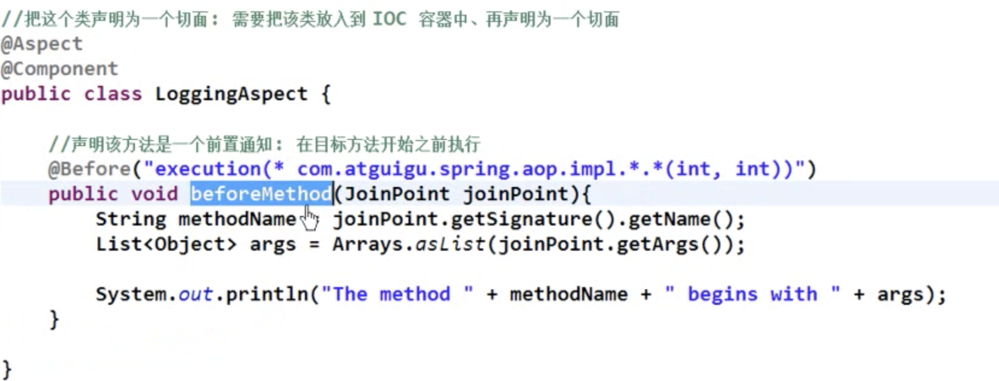
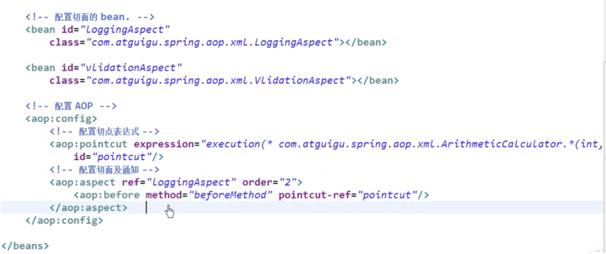

# Spring 框架学习笔记

## Spring

### 1. IoC

> IoC (Inversion of Control / 反转控制)，	是 Spring 框架中最重要的技术。
> Spring 将负责所有的对象创建、销毁（生命周期），你需要什么对象，就返回什么对象，我们不再需要自己创建对象。
> IoC 需要一个配置文件（声明对象名称 / 路径），以及一个 IoC 容器（创建对象）。
>
> spring IOC的好处是，对象的构建如果依赖非常多的对象，且层次很深，外层在构造对象时很麻烦且不一定知道如何构建这么多层次的对象。 IOC 帮我们管理对象的创建，只需要在配置文件里指定如何构建，每一个对象的配置文件都在类编写的时候指定了，所以最外层对象不需要关心深层次对象如何创建的，前人都写好了。

IoC 容器包括两种：Bean Factory 和 Application Context。容器本身是一种 Interface。目前主流的容器选择 Application Context，因为它的功能更多。

````
ApplicationContext ac = new ClassPathXMLApplicationContext("config.xml");
// ClassPathXMLApplicationContext 是实现 ApplicationContext 接口的类
// "config.xml" 就是配置文件
// ApplicationContext 被创建后，将会查看配置文件，并为配置文件中注册的所有 beans 创建对象
// 创建出来的对象将会储存在 ApplcaitionContext 容器中

Phone p = (Phone) ac.getBean("phone");
// 这句话写好后，只需修改配置文件中的 bean 的 class 属性，便可以更改 getBean 返回的对象
````


### 2. 基于 XML 文件的配置方式

````
<beans xmlns="http://www.springframework.org/schema/beans"
	xmlns:ctx="http://www.springframework.org/schema/context"
	xmlns:xsi="http://www.w3.org/2001/XMLSchema-instance"
	xmlns:mvc="http://www.springframework.org/schema/mvc"
	xsi:schemaLocation="http://www.springframework.org/schema/beans 
	http://www.springframework.org/schema/beans/spring-beans-2.5.xsd
	http://www.springframework.org/schema/mvc
	http://www.springframework.org/schema/mvc/spring-mvc-3.0.xsd
	http://www.springframework.org/schema/context
	http://www.springframework.org/schema/context/spring-context-2.5.xsd ">
	
	<!--A registered bean -->
	<bean id="phone" class="com.ning.spring.Huawei">
	</bean>
</beans>
````

XML 配置文件中的 id，都是我们自己定义的。

### 3. Dependency Injection (DI) 注入方式

> Q: Why we need Dependency Injection? 
>
> A: Because we should avoid hard coding. Hard coding is lack of flexibility.
>
> DI和IOC其实是一个思想，她们的的好处是：如果依赖的类修改了，比如修改了构造函数，如果没有依赖注入，则需要修改依赖对象调用着，如果依赖注入则不需要。

**Dependency types:**

* Dependency in form of literals (int / String / ... / 变量)
* Dependency in form of objects
* Dependency in form of collections (ArrayList / ...)

**Dependency in form of literals: Setter Injection**

````
	<!-- 变量注射使用定义 property -->
	<!-- Spring 将会调用 setter 函数赋予 property ”price“ 一个值 “3999”, 
	在 Huawei 类中，需要定义 setter 函数 -->
	
	<bean id="phone" class="com.ning.spring.Huawei">
		<property name="price" value="3999" type="int"></property>
    </bean>
````


**Dependency in form of literals: Constructor Injection**

````
	<!-- 变量注射使用定义 constructor -->
	<!-- 在 Huawei 类中，需要定义一个 constructor -->
	
	<bean id="phone" class="com.ning.spring.Huawei">
		<constructor-arg name="price" value="3999" type="int"/>
    </bean> 
````


**Dependency in form of objects**

````
	<bean id="phone" class="com.ning.spring.Huawei">
		<property name="price" value="3999"></property> <!-- Literal injection-->
		<property name="cpu">	<!-- Object injection -->
			<bean class="com.ning.spring.Kirin"></bean>
		</property>
    </bean>
<!-- 在 Huawei.class 中需要创建一个 Processor 的 setter -->
````


如果我们需要创建很多 Student, 使用这种方法的话，会创建很多 MathCheat，这样是不好的。
我们应该将 MathCheat 提取出来。
下面的实例，将 kirin 从 huawei 中提取出来，减少了kirin 生成的次数。

````
	<bean id="kirin" class="com.ning.spring.Kirin"></bean>
	
	<bean id="phone" class="com.ning.spring.Huawei">
		<property name="price" value="3999"></property> 
		<property name="cpu" ref="kirin" />
    </bean>
````

### 4. Bean 自动装配

Bean 自动装配是指装配 bean 的类属性成员，通过 match 其他 bean 的 name 或者 type 来装配。

**Autowiring by name**

````
	<bean id="kirin" class="com.ning.spring.Kirin"></bean>
	<bean id="phone" class="com.ning.spring.Huawei" autowire="byName"> 
    </bean>
````
使用 autowire by name 时，在 Huawei 中创建的 Processor 接口的对象名称一定要和想要调用的 Processor 的类的 id 一样（变量名称 == id 名称）。
在上述例子中，Huawei 类中定义了一个名称为 “kirin” 的 Processor 类变量，此时装配时想要调用的 Processor 类的 bean 对象名称一定要是 “kirin”。

PS: 如果没有 match 的 bean 则不装配，不会报错。


**Autowiring by type**

````
	<bean id="kirin" class="com.ning.spring.Kirin"></bean>
	<bean id="phone" class="com.ning.spring.Huawei" autowire="byType"> 
    </bean>
````

和 by name 类似，通过匹配类型来装配。但是 ioc 中有一个以上的相同类型的话，会报错。

> 另外还有 ``autowire="constructor"``, 需要定义一个构造器，不常用。

**自动装配的缺点：**

- 使用自动装配 autowire 属性，会自动装配所有的属性，不够灵活，不够清晰。
- 使用 byName 就不能用 byType，不够灵活。

### 5. Bean 配置继承和依赖

通过继承已经存在的 bean 的配置，简化配置。

````
<bean id="kirin" class="com.ning.spring.Kirin"></bean>  <!-- 父 bean -->

<bean id="kirin2" parent="kirin"></bean>    <!-- 子 bean -->
````

abstract 属性值为 true 代表该 bean 是抽象 bean，不可被实例化，只能被继承。

````
<!-- 抽象 bean -->
<bean id="kirin" class="com.ning.spring.Kirin" abstract="true"></bean> 
````

另外，如果一个 bean 没有 class 属性，则该 bean 自动被视作是抽象 bean，而且一定要加上 abstract=“true”。此外，继承配置不继承抽象属性。

通过依赖关系，指定 bean 的初始化顺序，使用``depends-on="xxx"``。例如，现在要初始化 bean id 为 xxx2 的 bean，且属性里有 ``depends-on=“xxx1 xxx0”`` 那么在初始化该 bean 之前，必须初始化 bean id 为 xxx1 和 xxx0 的 bean。

### 6. Bean 的作用域

通过 scope 属性来配置 bean 的作用域：

scope=“singleton” ：单例的， 在 IOC 的整个生命周期内，只创建一次这个指定的 bean。容器默认使用这种模式。

scope=“prototype”：原型的，在 IOC 初始化时不创建 bean 实例，而在每次请求时才创建一个 bean 实例，并返回。

### 7. 外部属性文件

将属性文件导入项目后，在配置文件中需声明以下代码。

````
<context:property-holder location="classpath:xxxx.properties />
````

然后将 bean 中的 ``property value`` 改成 ``value="${xxx.xxx}"``，name 保持不变。在属性文件中，name 必须对应 bean 中 property 的 name，格式如下：

````
username=bei
password=123
...
````

这样就可以将需要频繁修改的属性值转移到外部属性文件中。

### 8. SpEL 

property 属性中的 value 可以写成 SpEL 表达式： ``value="#{...}"``。 在#{ }中可以引用其他的 bean 以及 bean 的属性，也可以进行运算，也可以进行判断。

### 9. Bean 的生命周期

1. 在初始化 IOC 容器之后，通过构造器或工厂方法创建 bean 实例。
2. 为 bean 的属性设置值和引用其他的 bean。
3. 调用 bean 的初始方法。
4. Bean 可以使用了。
5. 当容器关闭时，调用 bean 的销毁方法。

Container started **-->** Bean initialisation **-->** dependency injection **-->** init() method **-->** bean ready to use **-->** before container shutdown：destroy() method **-->** container shutdown

在 bean 的声明设置中设置 init-method 和 destroy-method 属性，来指定 bean 的初始化方法和销毁方法。

````
<bean id="kirin" class="com.ning.spring.Kirin" 
	init-method="initalxxx"
	destroy-method="destroyxxx">
	<property name="vlome" value="5.0"></property>
</bean>
````

**后置处理器**

在所有 bean 初始化的前后执行。

？？？是所有bean初始化完执行，还是一个bean初始化完就执行一次？？？

实现：需要新建一个类，并实现 BeanPostProcessor 接口，然后具体实现两个方法：postProcessBeforeInitialization：在 init-method 前执行；postProcessAfterInitialization：在 init-method 后执行。两个方法中可以修改返回的 bean，也可以返回新的 bean。

在 xml 文件中需要初始化该类的 bean：``<bean class="xxx.xxx.xxx.myBeanProcessor"></bean>``。该声明不需要 id，IOC 容器会自动识别是一个后置处理器。

### 10. 基于注解的配置方式（半注解）

需要在 XML 文件中加入以下声明：

````
<ctx:component-scan base-package=“xxx.xxx.xxx”>
	<!-- 可以选择不包含哪些包，以及只包含哪些包 -->
	<contex:include-filter type="annotation" expression="xxx.xxx.xxx"/>
	<!-- <contex:exclude-filter type="annotation" expression="xxx.xxx.xxx"/> -->
</ctx:component-scan>
````

1. 然后在相应的类文件中，分别在开头加上 ``@Component， @Controller， @Service 和 @Repository``，在 IOC 容器初始化后，将把目标包中带有这些标示的类进行实例化。在实例化的过程中，如果 bean 需要配置类成员变量，则通过变量前或 setter 函数前的 ``@Autowired`` 自动将对应类型的 bean 注入到该成员变量中。（若使用了 ``@Autowired`` spring 就必须找到相应的 bean，找不到就会报错，所以如果不是必要配置的属性，可以追加 ``@Autowired(required=false)`` )

2. 在自动匹配对应类型的 bean 完成类成员匹配时，容易出现项目中存在多个相同类型的类（继承），如不处理将会报不存在唯一 bean 的错。第一种方法，可以在``@Component， @Controller， @Service 和 @Repository`` 后面追加 ``("xxxbean_idxxx")`` 使得 bean 唯一。第二种，在 ``@Autowired`` 下加上 ``@Qualifier("想要的bean名")`` 

3. 父类之间的 @Autowired 可以被子类继承。


**Autowired by annotation**

* First we need to activated it in config.xml by ``<context:annotation-config/>``.

* Then we can add ``@Autowired`` before **the constructor**, it will function the same with ``autowire="constructor"``.

* Or we can add  ``@Autowired`` before **the setter method**, it will function the same with *byType*. Because @Autowired will first try to resolve with *byType* and if *byType* is failed (when there are two or more different beans with a same class type, Spring cannot decide which bean to choose), it goes with *byName*. 

* Another way is to add ``@Autowired`` before **the variable** / the dependency, the concept is the same with adding it before the setter method, but there will be no need to write the setter method and constructor.

* Autowiring is not possible for **primitive** （基本数据类型） or **String** type. They can only be configured in *config.xml* by using ``<property>``.

**@Qualifier**

* It is used to solve the confiliction of *byName*.

* Add ``@Qualifier("kirin")`` after ``@Autowired``.


**@Value / @Required / Properties File**

> With properties file, we do not need to add ``<property>`` tag inside ``<bean>`` in XML config file.

* 第一种方法（XML configuration）：在配置文件中需声明以下代码。并将 bean 中的 ``property value`` 改成 ``value="${xxx.xxx}"``。

````
<context:property-holder location="classpath:xxxx.properties />
````

* 第二种方法 (Annotation config)：Insert ``@Value("${xxx.xxx}")`` before setter methods or before variables / field. (If we add it before variables, we do not need to write the stter methods)

````
<context:property-holder location="classpath:xxxx.properties />
<context:annotation-config />   // whenever uses annotation, this is required
````

* Or we can directly inject values by ``@Value("xxx")``, where xxx is the value.
* If we hope a bean object would not be created if some dependencies are not listed in properties file, we add ``@Required`` before ``@Value``.  

### 11. Spring AOP

AOP 的底层是动态代理。

**AOP 的流程（**基于注解）：


**前置通知：**（后置通知类似于前置）



**返回通知 / 异常通知：**


**环绕通知：**（十分类似动态代理，不常用）


> b站弹幕：后置通知放在 final 块中，返回通知放在 return 前一句。

**优先级：**

可以使用 ``@Order(x)`` （和 ``@Aspect，@Component`` 放在一起），指定切面的优先级，x 越小优先级越高。

**重用切点：**

````java
//在切面中声明一个切点表达式，@Pointcut，一般不在该方法中添加代码
@Pointcut("execution(* com.ning.bei.calculator.*(..))")
public void joinPointExpression(){} 

//通知直接使用表达式名即可
@Before("joinPointExpression()")
public void beforeMethod(JoinPoint joinPoint){
  //前置通知代码 
}
````

**AOP 基于 XML 文件**




### 4. Annotation Configuration

>Annotation config is the same with XML config, but do not forget to add ``<context:annotation-config />`` and ``<context:component-scan base-package="com.xxx.xxx" />``

* @Component("xxx") --> ``<bean id="xxx"><bean/>``


> If we want to remove the XML configuration file, we need to create a Java configuration class.


* Add ``@Configuration`` and ``@ComponentScan(basePackages = "com.xxx.xxx")``in the head of this Java config class.
* Change ``ApplicationContext ac = new ClassPathXMLApplicationContext("config.xml")`` to ``ApplicationContext ac = new AnnotationConfigApplicationContext(config.class)``

>If we want to remove ``@Component`` annotation, we can use ``@Bean`` in the *config.class*
>These two way to create beans are both all right.

* Delete ``@Component`` inside all classes and ``@ComponentScan(...)`` inside the config class.
* Create beans inside the config class, the default bean id will be the method name.

````
Example of a configuration file:

@Configuration
public class Config(){

	@Bean
	public Principal principalBean(){
		return new Principal();
	}
	
	@Bean(name={"colleagebean","callBean"})
	public Colleage colleageBean(){
		return new colleage(principalBean()); 
		
		//we put principalBean() inside colleage()
		//beacause colleage has a constructor that has a principal argument
		//we can also put setter method in colleage()...
	}
}
````

After we done with our work, we need to close our Application Context, by ``((AnnotationConfigApplcationContext)ac).close();``

Annotation config type of injecting properties file:

Add ``@PropertySource("xxx.xxx.xxx.properties")`` in the head of the config file.


**@PostConstruct / @PreDestroy**

Add ``@PostConstruct`` will make the method became **init** method, spring will call it when the bean object is created.

By adding ``@PreDestroy`` before a method in a bean, Spring will execute the method before the container object is destroyed / closed.

When we are developing a standalone app (Java SE), we need to create container object (ApplicationContext) manually. 
But if we are developing a web app (Java EE), these work will be done by Spring automatically.

We can also do this in XML config way, by adding ``init-method="xxx()"`` and ``destroy-method="xxx()"`` inside the ``<bean ___>`` tag.


When the init() and destroy() gets too many, we can config it in the ``<beans>`` tag.

### 5. Bean Lifecycle

Container started **-->** Bean initialisation **-->** dependency injection **-->** init() method **-->** bean ready to use **-->** before container shutdown **-->** destroy() method **-->** container shutdown

**How to shutdown the container?**

We can use both ``context.close();`` or ``context.registerShutdownHook();``.
The difference is that ``registerShutdownHook()`` will be executed only when the main method ends, so we can put it anywhere. 
However, ``close()`` method will be executed once the program meets it. 

Except @PostConstruct / @PreDestroy and XML config, there is another way of setting init() and destroy():


## Spring MVC

### 1. XML Based Configuration

web.xml

	这是用来初始化的，用来映射 url 到具体的 servlet。
	在 Spring MVC 中，通过设置将所有的 url ("/") 都引到 Dispatcher Servlet 上。

{Dispatcher}-servlet.xml

	这是对 Dispatcher Servlet 的配置文件，规定去哪里找到所有的 Controller（ComponentScan）。


### 2. Annotation Based Configuration

{webInitializer}.java

````
public class webInitializer extends AbstractAnnotationConfigDispatcherServletInitializer {

	@Override
	protected Class<?>[] getRootConfigClasses() {
		// TODO Auto-generated method stub
		return null;
	}

	@Override
	protected Class<?>[] getServletConfigClasses() {
		
		return new Class[] {DispatcherConfig.class};
	}

	@Override
	protected String[] getServletMappings() {
		
		return new String[] { "/" };
		//将所有的 url 都引到 Dispatcher Servlet 中
	}
}
````

DispatcherConfig.java

````
@Configuration
@ComponentScan("com.ning") //Controllers 所在的 package
@EnableWebMvc
public class DispatcherConfig {
	//配置返回的 view 页面
	@Bean
	public InternalResourceViewResolver viewResolver() {
		InternalResourceViewResolver vResolver = new InternalResourceViewResolver();
		vResolver.setPrefix("/WEB-INF/"); //页面所在的位置
		vResolver.setSuffix(".jsp"); //可以是任何类型
		return vResolver;
	}
}
````

AddController.java

````
@Controller
public class AddController {
	
	@RequestMapping("/add")
	public ModelAndView add(@RequestParam("t1") int i, @RequestParam("t2") int j, HttpServletRequest request, HttpServletResponse response) {
		System.out.println("i am here");
//		int i = Integer.parseInt(request.getParameter("t1"));
//		int j = Integer.parseInt(request.getParameter("t2"));
		
		//AddService 计算 i 和 j 的和
		AddService aService = new AddService();
		int k = aService.add(i, j);
		
		ModelAndView mView = new ModelAndView();
		mView.setViewName("display");
		mView.addObject("result",k);
		
		return mView;
	}
}
````


### 注意点
1. 将 Controllers 全部放到合适的 package （example: src/main/**java**/com/...）下，并可以将 Service 从 Controller 中分离出来，进一步降低耦合，在使用时直接创建 Service 对象即可。
