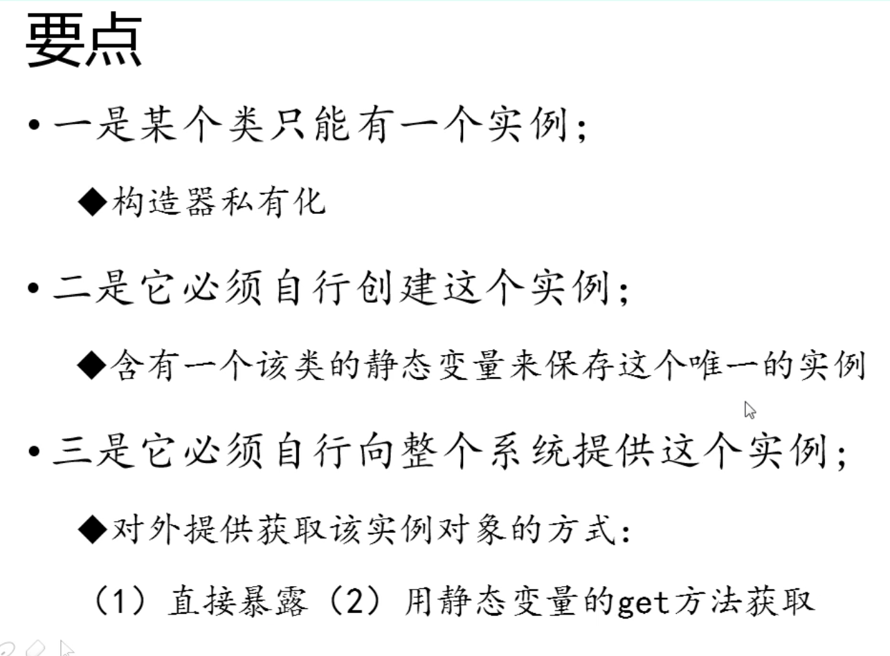

# 尚硅谷面试题总结

## 1. 自增量

````java
public static void main(String args[]){
  int i = 1;
  i = i ++;
  int j = i ++;
  int k = i + ++ i * i ++;
  System.out.println("i = " + i);
  System.out.println("j = " + j);
  System.out.println("k = " + k);
}
````

题：输出的结果是什么？

答：

````java
i = 4
j = 1
k = 11
````

解题思路：

1. 这种问题使用操作数栈和局部变量表进行解答。
2. 赋值 =，是最后计算的。
3. 等号右边从左到右的值依次压入操作数栈中。
4. 实际先算哪个，看运算符的优先级。
5. 自增、自减是直接修改局部变量表中的值，而不经过操作数栈。
6. 最后复制之前，临时结果也是存储在操作数栈中。


## 2. 单例设计模式

> 单例设计模式：指的是某个类在整个系统中只能有一个实例对象可以被获取和使用的代码模式。
>
> 例如：代表 JVM 运行环境的 Runtime 类。




````java
// 1. 饿汉式：在类初始化时，直接创建实例对象，不管是否需要这个对象都会创建
public class Singleton1{
  //强调这是一个单例，可以用 final 修饰
  public static final Singleton1 INSTANCE = new Singleton1(); 
  private Singleton1(){
  }
}
//如何调用 INSTANCE
public static void main(String[] args){
  Singleton1 s = Singleton1.INSTANCE;
}

// 1.2. 饿汉式，枚举类型：表示该类型对象是有限的几个
// 我们可以限定为一个，就成了单例
public enum Singleton2{
  INSTANCE
}
//调用
public static void main(String[] args){
  Singleton2 s = Singleton2.INSTACNE;
  //s 的返回值和第一种不一样，因为是枚举，返回的就是 INSTANCE。
}

// 1.3. 饿汉式：使用静态代码块 (如果类构造器需要参数，可能需要从配置文件中加载参数，这个时候就要用这种方法。简单说就是直接创建实例不行，需要加载配置文件，所以要使用静态代码块。)
public class Singleton3 throw Exception{
  public static final Singleton3 INSTANCE；
    private String info;
  static{
    Properties pro = new Properties();
    pro.load(Singleton3.class.getClassLoader().getResourceAsStream("single.properties"));
    //这里回顾一下加载配置文件的方法：首先创建一个配置文件实例，其次通过 Singleton3 得到系统类加载器，然后通过类加载器得到配置文件的输入流（InputStream），最后将输入流放入配置文件实例的 load() 方法中。
    //之后想要得到配置文件中的配置信息，只要使用 getProperty("配置信息名称") 就可以了。
    INSTANCE = new Singleton3(pro.getProperty("info")); 
  }  
  private Singleton3(String info){
    this.info = info;
  }
}
// 调用
public static void main(String[] args){
  Singleton3 s = Singleton3.INSTACNE;
}

// 2.1. 懒汉式：延迟创建实例对象，
public class Singleton4{
  //私有化的实例对象，不同于饿汉式，不对外直接提供，外部想要获取，必须通过下面的方法，从而达到延迟创建对象的目的。
  private static Singleton4 instance;
  //私有化的构造器
  private Singleton4(){
  }
  //对外提供一个获取实例对象接口
  public static Singleton4 getInstance(){
    if(instance == null){
      instance = new Singleton4();
    }
    return instance;
  }
}

//调用
public static void main(String[] args){
  //如果单线程获取单例对象，不存在线程安全问题
  Singleton4 s1 = Singleton4.getInstance();
  Singleton4 s2 = Singleton4.getInstance();
  System.out.println(s1==s2); //输出为 true
  
  //如果多线程获取单例对象，存在线程安全问题，因为没有使用了同步方法上锁

}

````


