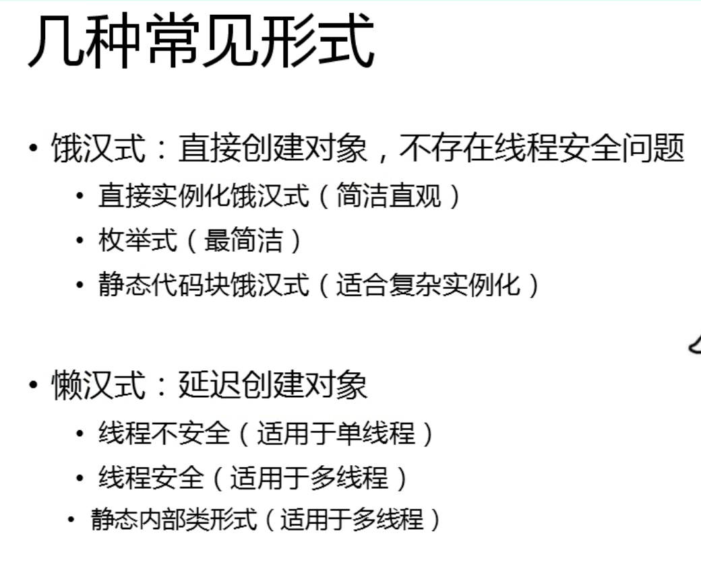
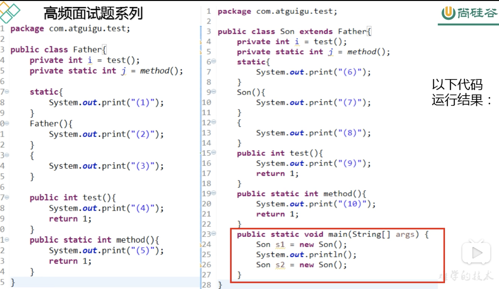

# 尚硅谷面试题总结

## 1. 自增量

````java
public static void main(String args[]){
  int i = 1;
  i = i ++;
  int j = i ++;
  int k = i + ++ i * i ++;
  System.out.println("i = " + i);
  System.out.println("j = " + j);
  System.out.println("k = " + k);
}
````

题：输出的结果是什么？

答：

````java
i = 4
j = 1
k = 11
````

解题思路：

1. 这种问题使用操作数栈和局部变量表进行解答。
2. 赋值 =，是最后计算的。
3. 等号右边从左到右的值依次压入操作数栈中。
4. 实际先算哪个，看运算符的优先级。
5. 自增、自减是直接修改局部变量表中的值，而不经过操作数栈。
6. 最后复制之前，临时结果也是存储在操作数栈中。


## 2. 单例设计模式

> 单例设计模式：指的是某个类在整个系统中只能有一个实例对象可以被获取和使用的代码模式。
>
> 例如：代表 JVM 运行环境的 Runtime 类。




````java
// 1. 饿汉式：在类初始化时，直接创建实例对象，不管是否需要这个对象都会创建
public class Singleton1{
  //强调这是一个单例，可以用 final 修饰
  public static final Singleton1 INSTANCE = new Singleton1(); 
  private Singleton1(){
  }
}
//如何调用 INSTANCE
public static void main(String[] args){
  Singleton1 s = Singleton1.INSTANCE;
}

---------------------------------------------------
// 1.2. 饿汉式，枚举类型：表示该类型对象是有限的几个
// 我们可以限定为一个，就成了单例
public enum Singleton2{
  INSTANCE
}
//调用
public static void main(String[] args){
  Singleton2 s = Singleton2.INSTACNE;
  //s 的返回值和第一种不一样，因为是枚举，返回的就是 INSTANCE。
}

---------------------------------------------------
// 1.3. 饿汉式：使用静态代码块 (如果类构造器需要参数，可能需要从配置文件中加载参数，这个时候就要用这种方法。简单说就是直接创建实例不行，需要加载配置文件，所以要使用静态代码块。)
public class Singleton3 throw Exception{
  public static final Singleton3 INSTANCE；
    private String info;
  static{
    Properties pro = new Properties();
    pro.load(Singleton3.class.getClassLoader().getResourceAsStream("single.properties"));
    //这里回顾一下加载配置文件的方法：首先创建一个配置文件实例，其次通过 Singleton3 得到系统类加载器，然后通过类加载器得到配置文件的输入流（InputStream），最后将输入流放入配置文件实例的 load() 方法中。
    //之后想要得到配置文件中的配置信息，只要使用 getProperty("配置信息名称") 就可以了。
    INSTANCE = new Singleton3(pro.getProperty("info")); 
  }  
  private Singleton3(String info){
    this.info = info;
  }
}
// 调用
public static void main(String[] args){
  Singleton3 s = Singleton3.INSTACNE;
}

---------------------------------------------------
// 2.1. 懒汉式：延迟创建实例对象，（单线程版）
public class Singleton4{
  //私有化的实例对象，不同于饿汉式，不对外直接提供，外部想要获取，必须通过下面的方法，从而达到延迟创建对象的目的。
  private static Singleton4 instance;
  //私有化的构造器
  private Singleton4(){
  }
  //对外提供一个获取实例对象接口
  public static Singleton4 getInstance(){
    if(instance == null){
      instance = new Singleton4();
    }
    return instance;
  }
}

//调用情况
public static void main(String[] args){
  
  //如果单线程获取单例对象，不存在线程安全问题
  Singleton4 s1 = Singleton4.getInstance();
  Singleton4 s2 = Singleton4.getInstance();
  System.out.println(s1==s2); //输出为 true
  
  //如果多线程获取单例对象，存在线程安全问题，因为没有使用了同步方法上锁
  Callable<Singleton4> c = new Callable<Singleton4>(){
    @Override
    public Singleton4 call() throws Exception{
      return Singleton4.getInstance();
    }
  };
  ExecutorService es = Executors.newFixedThreadPool(2);
  Future<Singleton4> f1 = es.submit(c);
  Future<Singleton4> f2 = es.submit(c);
  
  Singleton4 s1 = f1.get();
  Singleton4 s2 = f2.get();
  
  Singleton4 s1 = Singleton4.getInstance();
  Singleton4 s2 = Singleton4.getInstance();
  System.out.println(s1==s2); //输出可能为 false
}


---------------------------------------------------
// 2.2. 懒汉式：延迟创建实例对象（多线程版）
// 将获取实例对象接口方法变成同步方法，或加入同步代码块。详见 Java基础中多线程章节
  
---------------------------------------------------
// 2.3. 懒汉式：静态内部类
// - 在内部类被加载和初始化时，才创建INSTANCE实例对象
// - 静态内部类不会自动随着外部类的加载和初始化而初始化，他是要单独去加载和初始化的。
// - 因为是在内部类加载和初始化时创建的，因此是线程安全的。
public class Singleton6{
  
  //私有化的构造器
  private Singleton6(){
  }
  
  private static class Inner{
     private static final Singleton6 INSTANCE = new Singleton6();
  }
  
  //对外提供一个获取实例对象接口
  public static Singleton6 getInstance(){
    return Inner.INSTANCE;
  }
}
````


## 3. 类初始化和实例初始化



运行结果：

````
5 1 10 6 9 3 2 9 8 7
9 3 2 9 8 7
````

**类初始化过程**：

1. 一个类要创建实例需要先加载并初始化该类。
   - main方法所在的类需要先加载和初始化。
2. 一个字累要初始化需要先初始化父类。

3. 一个类初始化就是执行 <clinit>() 方法。
   - <clinit>() 方法由静态类变量显示赋值代码和静态代码块组成 。
   - 类变量赋值代码和静态代码块从上到下顺序执行。
   - <clinit>()方法只执行一次。

**实例初始化过程**：

1. 实例初始化就是执行<init>()方法。
   - <init>()方法可能重载有多个，有几个构造器就有几个<init>方法。
   - <init>()方法由非静态实例变量显示赋值代码和非静态代码块、对应构造器代码组成。
   - 非静态实例变量显示赋值代码和非静态代码块执行顺序由上到下，对应构造器的代码最后执行。
   - 每次创建实例对象，调用对应构造器，执行的就是对应的<init>() 方法。
2. 在子类的构造器中一定存在 super( ？)，对应父类的<init>() 方法，而且是被 <init>() 方法首先执行的，优先于上面提到的其他子类中的代码。

**方法的重写**：

1. 哪些方法不可以被重写：
   - final 方法
   - 静态方法
   - private 等子类中不可见方法
2. 对象的多态性
   - 子类如果重写了父类的方法，通过子类对象调用的一定是子类重写的代码。
   - 非静态方法默认的调用对象是this。
   - this对象在构造器或者说<init>方法中就是正在创建的对象。

> 在执行 super() 时，在执行父类中的非静态方法时，前面其实有一个默认的对象 this，this在构造器（<init>）中表示的是正在创建的对象，因为这里是在创建 Son 对象，所以父类中 test() 执行的是子类重写的代码（面向对象多态）。
>
> 这里创建子类对象实例初始化时，执行super() 中的父类中 i = test() 执行的是子类重写的 test() 方法。