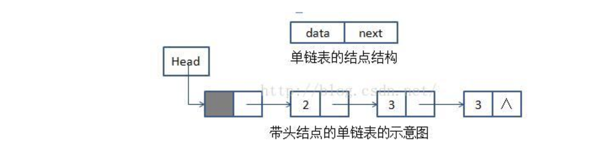
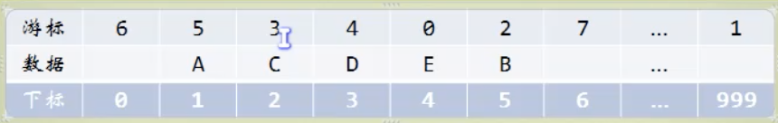

## 线性表

### 顺序存储结构

###链式存储结构（单链表）

头节点

头指针(Head)，指针名则为链表名，

空指针，链表最后一个结点的指针域为 null（空指针）

插入方法：头插法、尾插法

### 静态链表

使用顺序存储结构（数组）来实现链表，被称为静态链表。之所以为静态，是因为数组在初始化时必须确定大小，所以是静态的。

在静态链表中，通过游标来解决顺序的问题，静态链表的插入 以及 静态链表的删除，都可以通过更改游标来实现的。

- 优点：通过修改游标，不需要移动元素，从而改进了在顺序存储结构中的插入和删除操作需要移动大量元素的缺点

- 缺点：没有解决连续存储分配（数组）带来的表长难以确定的问题；失去了顺序存储结构随机存取的特性（因为具备了单链表的特性，无法通过索引直接找到对应顺序的元素）。

### 循环链表

是将单链表的尾部指向头部的单链表。

添加，删除，寻找

### 约瑟夫环

魔术师发牌

拉丁矩阵

### 双向链表

## 栈 

栈是一种特殊的线性表，也分为顺序存储结构和链式存储结构。

一般使用顺序表来实现。

### 顺序存储栈

小甲鱼版本的栈结构，包含了 top指针（指向顶元素的上一层空间），buttom指针（指向最底层的那个元素），stack size 

其他版本，包括 top 是整型变量，表示顶元素的索引。

两个地址相减，等到的是两个地址之间相隔的元素，而不是真的地址相减，而是相减后除以元素的sizeof()大小，两个地址类型必须相同，不然会出错。

### 链式存储栈

使用单链表来存储栈。栈顶为单链表的表头，栈尾为单链表的表尾。

 逆荷兰计算法 （将我们平时写的中缀表达式写为后缀表达式，后缀表达式通过栈结构可以有效地方便计算机计算）

那么如何将中缀表达式转化为后缀表达式呢？也可以通过栈来转化。

## 队列

也可以通过顺序表或者链式表来实现。

程序的输入缓冲区接受键盘输入时，使用的也是队列结构。

和栈不一样，一般使用链式表来实现。

链式结构

顺序结构

通过循环顺序队列来解决每次出队列需要移动所有元素的麻烦。

## 递归

Finbonnaqi 数列：兔子的繁殖

递归的定义

分治思想

汉诺塔

## 字符串

kmp 算法：字符串的匹配

## 树

通过顺序数组和链表的结合来存储树：

### 二叉树

定义：每个节点有小于等于2个子节点的树。

特殊二叉树

满二叉树：所有叶子都在同一层。

完全二叉树：是连续的，一层满了才能往下一层放叶子。

前序遍历：双亲 --> 左子节点 --> 右子节点 

中序遍历：左子节点 --> 双亲 --> 右子节点 

后序遍历：左子节点 --> 右子节点 --> 双亲

层序遍历

线索二叉树（中序遍历）

### 赫夫曼编码

## 图

储存结构：通过一个一位数组存储顶点，二维数组存储边。

邻接表：表示相邻顶点之间的距离。

十字邻接表

边集数组

遍历方法：深度优先遍历（一条路走不通再走另一条）

马踏棋盘算法

广度优先遍历（队列实现，邻接表广度遍历）

最小生成树：

1. 普里姆算法，从顶点集合的第一个顶点出发找到最短的路径将所有顶点连接在一起，形成一个树。

2. 克鲁斯卡尔算法：类似普里姆算法，首先将最短的边和对应的顶点依次选中，选中是需考虑避免出现环。

最短路径：

1. Dijkstra 算法 (狄杰斯特拉算法)，贪心法原则

   求的是一个顶点到所有其他顶点的最短路径

2. Floyd 算法 (弗洛伊德算法)

   所有顶点到所有顶点的最短路径。

### 拓扑排序

无环的有向图被称为无环图，DAG

AOV网（用顶点表示事件，边表示活动 ）不能存在回路。

AOV网可以通过数组和链表的结合来表示：

[tu]

关键路径：（跳过）

AOE网 有权值，AOV网没有权值。

找出最长的路径。

### 查找算法

插值查找

斐波那契查找

线性索引查找

1. 稠密索引：适用于小规模的数据量。建立一个等规模的索引表，将数据的指针按顺序进行存储。
2. 分块索引：将数据分割成小块，默认块内无序，块间有序。
3. 倒排索引：？？？

### 二叉排序树

顺序存储的数据查找快，但是增删慢，无序存储的数据正好相反，二叉排序树由此而生，是一种无序存储的数据类型，目的是提高查找、插入、删除的速度。

查找和插入比较简单，删除比较复杂。

删除分为三种情况：删除叶子结点、删除仅有一个子节点的节点、删除有两个子节点的节点。

前两种比较简单，最后一种比较复杂。

### 平衡二叉排序树

任意一个节点的子节点的深度差不超过1。

四种旋转：RR, LL, RL, LR，每一种旋转有三种形式的树

代码实现 AVL树的创建（困难，需要结合图片）

### 多路查找树 

目的：通过增加节点的存储数据，来减少查找的次数。

2-3 树：B树的一个特例（3阶B树，每个节点最多有三个子树），每个节点可以存储1个或2个元素，所有的叶子都在同一个层次上。插入和删除会比较复杂。

尽可能地拓宽树，把能利用的空间放满。

2-3-4 树：和2-3树类似，每个节点最多存储 3 个数据（4阶B树）。

B树：

### 散列表查找（哈希表）

冲突解决方法：

1. 开放定址法：冲突时，放到下一个可以放的空间
2. 链地址法：数组和链表结合，数组存放索引和第一个元素的地址，冲突时将新的元素链接到第一个元素上。
3. 公共溢出区法：建立一个基本表和一个溢出表，冲突的元素放在溢出表中。

## 排序算法

排序分为内排序和外排序，以下讨论的是内排序。

1. 稳定性：相同元素在排序前的顺序和排序后的顺序相同则为稳定，不同为不稳定。
2. 时间复杂度
3. 空间复杂度
4. 算法的复杂度
   1. 简单：
      * 冒泡排序：每一次迭代都通过比较相邻元素，并后移较大的元素，使得最大的元素像冒泡一样移动到数组的最后。
      * 选择排序：每次迭代选出一个最小的元素，放到未确定的数组头。
      * 插入排序：将下一个元素通过和已确定数组中的元素一一比较，插入到已确定的数组中。
   2. 改进：
      * 希尔排序：（插入排序的改进）通过 k 间隔，选出元素来进行插入排序，每一轮 k 递减，递减到 1 为止。
      * 堆排序：（选择排序的改进）
      * 归并排序：通过递归，
      * 快速排序：

