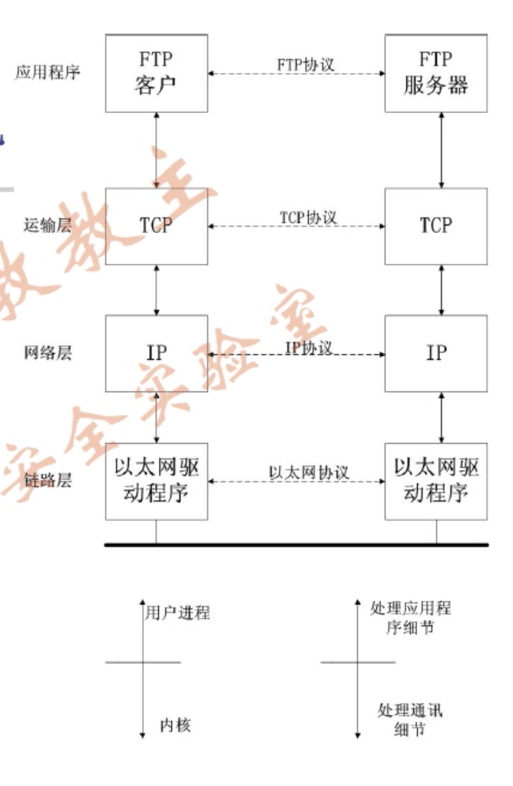
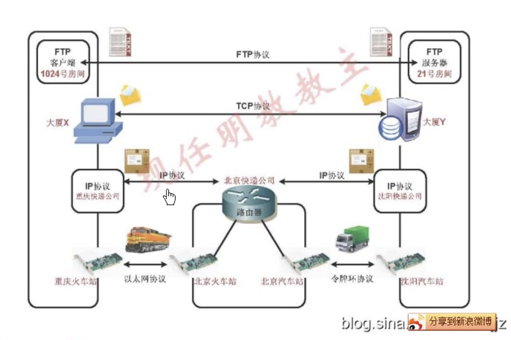
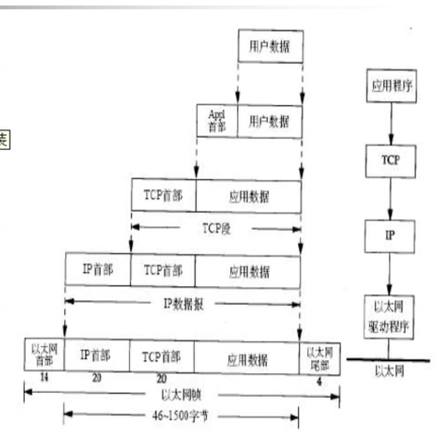
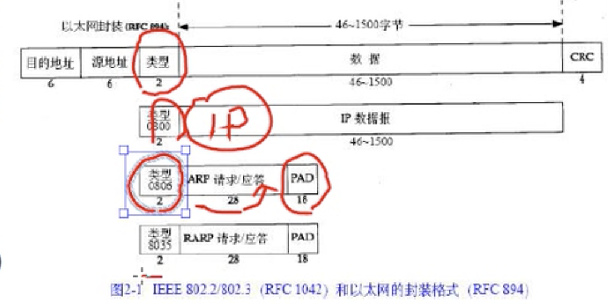

# 网络协议

## 1. 概述

### 1.1 分层

> **分层的好处**：对开发者隐藏数据通信的细节，不需要考虑数据是如何通讯的，方便开发。
>
> 互联网的目的之一：在应用程序中隐藏所有的物理细节。

**应用层**

1. 处理特定的程序细节。
2. 应用层关心应用程序的细节，通常是用书进程，下三层处理通讯细节，一般在内核（操作系统）执行。

**运输层**

1. 两台主机上的应用程序提供端到端的通讯。
2. TCP协议在不可靠的IP层上提供一种可靠的运输层（超时重传）。

**网络层**

1. 处理分组在网络中的活动。
2. IP协议提供的是一种不可靠的服务，只是尽快地把分组从源节点转送到目的节点。

**链路层**

处理与电缆的物理接口细节。 

### 1.2 封装

以太网的数据帧的长度必须在46-1500字节之间，不包含头部和尾部。

平时电脑、普通服务器发的包基本都是以太网格式封装的。

*重点记住类型0806，ARP协议很重要。*

每一层封装的首部都解释了其上一层是什么协议，比如TCP和UDP用的是一个16bit的端口号来表示不同的应用程序ftp、telnet、http等。IP首部是8bit长度，以太网首部是16bit。 

**端口号**

服务器一般是用过知名端口号来识别，一般低于1024。

客户端用的端口号一般叫做临时端口号，一般大于1024。

## 2. IP协议

> 特点：不可靠、无连接、数据报传送服务。

**不可靠：**如果发生错误，比如某个路由器暂时用完了缓冲区，IP会讲数据报丢弃，然后发送ICMP消息报给信源。

**无连接：**每个数据报的处理都是相互独立的，不维护任何的关于猴戏数据报的状态信息。IP数据报可以不按发送顺序接受，但是TCP必须按照顺序收报（同一信源的不同数据报在网络中传送的时间不一定相同，错误顺序的报在TCP中会被缓存，直到正确顺序的报出现，所以TCP会排序，但是IP是不排序的）。

## FTP

> 数据传输的主流协议

两个信道：第一信道控制信道和第二信道数据信道

## HTTP

> 超文本传输协议，TCP80。
>
> 主要特点：哑服务器

Cookies 让瞬时的 http 看似持续。 